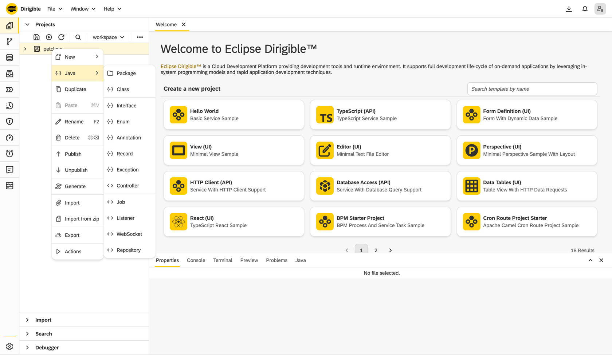
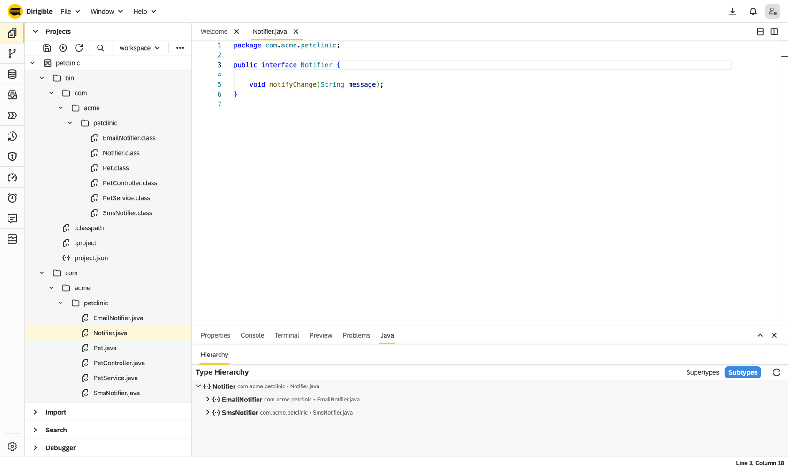
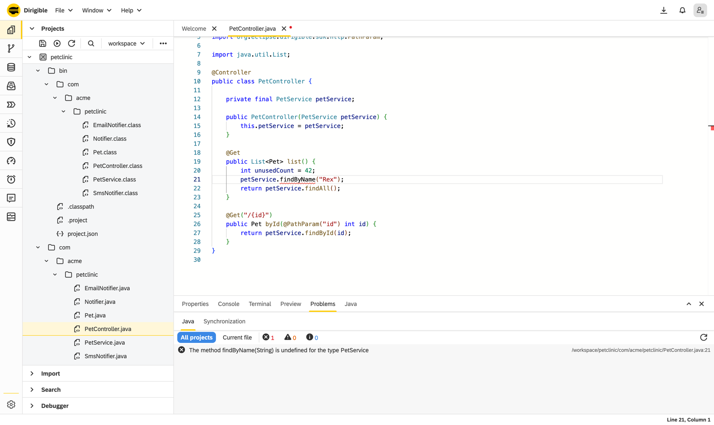

The saga so far: in [May the decorators came home to Java](../../05/19/dirigible-java-decorators.md) - `@Entity`, `@Repository`, `@Controller` - and in June [a real bean container](../../06/22/dirigible-java-spring-style.md) arrived to honour them, with constructor injection and Spring-Boot muscle memory. Two posts about *what you write* and *how it runs*.

There was a quiet catch. You were writing all that beautiful, annotated, dependency-injected Java in an editor that, frankly, treated it like a `.txt` file with nice colours. No completion that knew your beans. No jump-to-definition. No red squiggle until the server told you. The runtime had grown up; the editor hadn't.

Now the editor has caught up - and then some. The Dirigible web IDE now speaks Java through [Eclipse JDT Language Server](https://github.com/eclipse-jdtls/eclipse.jdt.ls) (the same engine behind Java tooling in every serious editor), wired straight into Monaco in the browser. IntelliSense, refactoring, Call and Type Hierarchies, a live diagnostics panel, and an honest breakpoint debugger. No plugin to install, no SDK to download, no `JAVA_HOME` to argue with. Open a tab, write Java.


Here's what landed.

<video src="../../../../images/java-web-ide/completion.mp4" poster="../../../../images/java-web-ide/overview.png" autoplay loop muted playsinline aria-label="Typing in a Java controller and the type-aware completion popup listing the injected service's own methods"></video>

## Autocomplete that's actually read your code

Press `Ctrl+Space` and you no longer get a dumb word list - you get JDT.LS completion that understands the whole classpath: the platform SDK, Spring, Hibernate, the JDK, and every other `.java` in your project. Pick a class and **the import is added for you**. Better still, Dirigible's own SDK annotations are ranked to the top, so typing `@` surfaces `@Controller`, `@Component`, `@Entity` before anything from a transitive dependency you've never heard of.

The rest of the desktop-IDE comfort blanket is there too:

- **Quick-fixes** on the yellow lightbulb - create a missing field, add unimplemented methods, remove an unused variable.
- **Generate** constructors, getters/setters, `toString()`, `equals()`/`hashCode()` - with a member picker so you choose exactly which fields.
- **Organize imports** (`Shift+Alt+O`) - remove unused, group, sort.
- **Postfix completion** - type `order.var` and let it write `var x = order`; `value.sout` becomes `System.out.println(value)`.
- **Inlay hints** - parameter names shown inline at call sites, inferred types on `var`.
- **Semantic highlighting** - classes, methods, fields and keywords each get their own colour, not one flat black wall of text.
- **CodeLens** - a quiet "N references" above each method; click to peek.

It feels like a desktop IDE because, under the hood, it's the same language server a desktop IDE would use.

## Right-click → Java, and the boilerplate writes itself

Right-click a project or folder and there's a dedicated **Java** menu. Not "new empty file" - real scaffolding:

- **Package** - type a dotted name and it creates the nested folders.
- **Class, Interface, Enum, Annotation, Record, Exception** - with the package declaration and type skeleton already filled in from the fully-qualified name you type.
- **Ready-made `@Controller`, `@Repository`, `@Job`, `@Listener`, `@Websocket` skeletons** - the exact shapes from the programming model, generated correct on the first keystroke.

Give it `com.acme.orders.OrderController` and you get the folders, the `package` line, the annotation and the class body - then you start typing logic, not ceremony.



## Navigate like the codebase is on your machine

Because it is, as far as the editor is concerned:

- **Go to definition / implementation / type definition** - `Ctrl+Click` a type and land on its declaration, across files.
- **Find references** - every usage across the whole workspace, in a peek view with surrounding code; click to jump.
- **Rename symbol** (`F2`) - rename a method or class and *every* reference across *every* file updates - and if it's a public type, the file is renamed with it. Open editors reload to match.
- **Outline, breadcrumbs, sticky scroll, code folding, occurrence highlighting** - the structural niceties you stop noticing only because they're always right.

And the two headliners, in their own **Java** panel at the bottom:

- **Call Hierarchy** (`Ctrl+Alt+H`) - who calls this method, and who calls *them*, expanded lazily down the tree. Navigate straight to any caller.
- **Type Hierarchy** (`Ctrl+H`) - the full supertype/subtype tree for any type.

Tracing "what actually triggers this" used to mean a full-text search and a lot of faith. Now it's a tree you can walk.



## See every red squiggle before you hit run

The **Problems** panel grew a dedicated **Java** tab fed by live, workspace-wide compile diagnostics straight from JDT.LS - errors, warnings, info, hints. It's **push-based**, not polling: the moment the language server re-analyses, the list updates (debounced so it doesn't flicker). Toggle the scope between the current file and all projects, filter by severity, click a row to land on the exact line.

Then the part that's pure Dirigible. When you save, the container rebuilds your beans - and if it *can't*, those **bean-wiring errors land in the same Problems panel**: an unsatisfied dependency, an ambiguous type, a construction cycle, a class that illegally mixed two handler styles. The thing that would be a stack trace buried in a server log on a traditional stack is, here, a clickable problem marker in your browser pointing at the offending file. Compile-time *and* wiring-time mistakes, surfaced the same way, before a single request hits your code.



## Set a breakpoint. In a browser.

Yes, really. Click the glyph margin to drop a breakpoint, and the IDE attaches to the running JVM (over JDWP, bridged through the Debug Adapter Protocol). When execution pauses you get the full kit: **step in / over / out**, an inspectable **variables** view, and the live **call stack** - and clicking a stack frame opens the right source at the right line. That last bit sounds trivial; it wasn't. Source-path mapping was fixed so that stepping into a file in a git-backed workspace project opens *your* file instead of failing and closing the tab.

Debugging server-side Java, from a browser, against the very instance you're building in. No remote-debug launch config to hand-assemble.

<video src="../../../../images/java-web-ide/debug.mp4" poster="../../../../images/java-web-ide/debug.png" autoplay loop muted playsinline aria-label="Attaching the debugger, hitting a breakpoint and stepping: the highlighted line, call stack, variables and breakpoints in the in-browser debugger"></video>

## Save. That's the whole loop.

No `mvn package`. No build. No redeploy. No restart.

You hit `Ctrl/Cmd+S` - and that now *reliably* saves, every time, even while the language server is still warming up (organize-imports was pulled out of the save path so a busy LSP can never block it). The synchronizer recompiles every client source in one pass, swaps in a fresh classloader, rebuilds the bean container, and your **next request hits the new wiring**. The old generation becomes unreachable and the JVM reclaims its memory. The edit-to-running gap is the time it takes to press one key.

That loop is the whole reason Dirigible exists - [in-system programming](https://www.dirigible.io/), where you build the running system from inside itself. The IDE work here is what finally makes doing it in *Java* feel as good as it should.

## What you're actually writing

If you haven't seen the model, it reads like Spring Boot on purpose:

```java
@Controller
public class GreetingController {

    private final GreetingService greetings;   // constructor-injected by type

    public GreetingController(GreetingService greetings) {
        this.greetings = greetings;
    }

    @Get("/greet/{name}")
    public String greet(@PathParam("name") String name) {
        return greetings.greet(name);
    }
}
```

`@Component`, constructor injection, `List<T>` collection injection, `@Repository extends JavaRepository<T>`, self-describing `JobHandler` / `MessageHandler` / `WebsocketHandler` or method-level `@Scheduled` / `@Listener` / `@Websocket` - the full tour is in [*Muscle Memory: Spring-Style Beans and Injection*](../../06/22/dirigible-java-spring-style.md) and the [Coming from Spring Boot](/help/develop/coming-from-spring-boot) guide. Now you get to write all of it with completion, refactoring and a debugger behind you.

## Try it

1. Start Dirigible, open the IDE, and create or open a project.
2. Right-click → **Java** → `Controller`. Start typing - watch the completion, the auto-imports, the squiggles.
3. Save. Hit your endpoint. Set a breakpoint and step through it.

Prefer to start from working code? Clone any of the samples and publish:

- [`dirigiblelabs/sample-java-entity-decorators`](https://github.com/dirigiblelabs/sample-java-entity-decorators) - the kitchen sink: `@Entity` / `@Repository` / `@Controller` plus an injected service.
- [`sample-java-job-decorator`](https://github.com/dirigiblelabs/sample-java-job-decorator), [`-listener-decorator`](https://github.com/dirigiblelabs/sample-java-listener-decorator), [`-websocket-decorator`](https://github.com/dirigiblelabs/sample-java-websocket-decorator), [`-extension-decorator`](https://github.com/dirigiblelabs/sample-java-extension-decorator).

The developer docs live at [`/help/develop`](/help/develop) and the full SDK reference at [`/sdk/`](https://www.dirigible.io/sdk/).

## Missing something? Tell us.

We built this to feel like the Java IDE you already know - and we know you'll find the thing it doesn't do yet. Maybe it's an extract-interface refactor, a watch expression in the debugger, a formatter option, an inspection you rely on. **That's exactly what we want to hear.**

Open an issue at **[github.com/eclipse-dirigible/dirigible/issues](https://github.com/eclipse-dirigible/dirigible/issues)** and tell us what your desktop IDE does that ours doesn't yet. The fastest way onto the roadmap is a concrete "here's the workflow I miss."

The runtime grew up first. Now the editor has too. Open a tab - your Java has never had it this good in a browser.
