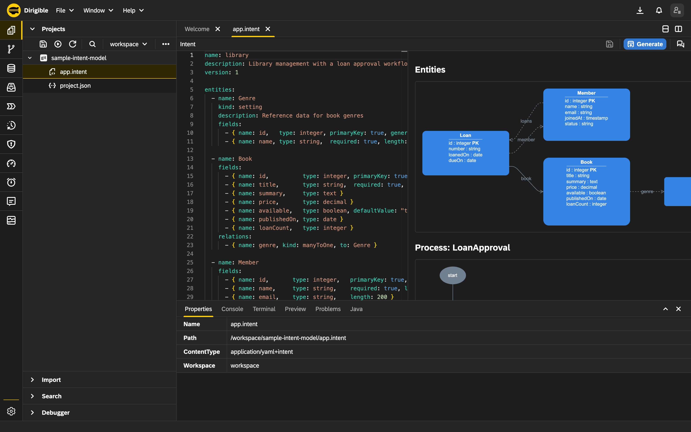
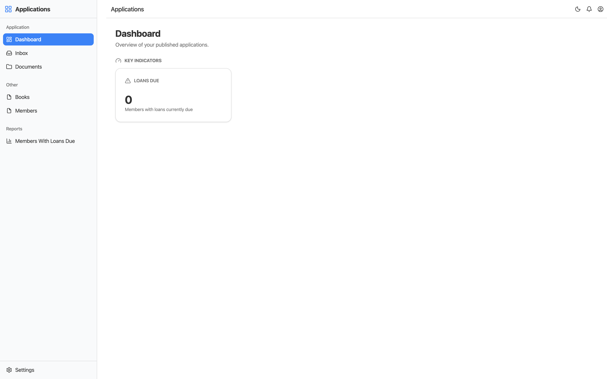

Most application platforms ask you to model first, then wire, then build a UI, then write the glue. [Eclipse Dirigible](https://www.dirigible.io/) now lets you work **one altitude higher**: you describe the application you want in a single **intent** file, and the platform generates the data model, the persistence, the REST APIs, the UI and the workflow for you.

In this article we build a real **Library management** application end to end - from an empty project to a running app with an approval workflow - without hand-writing CRUD, REST or UI code. The finished sample lives at [`sample-intent-model`](https://github.com/dirigiblelabs/sample-intent-model).

## The three altitudes

The idea you need to grok first: there are three levels, and you author only the top one.

| Altitude | Artefact | Authored by |
| --- | --- | --- |
| 1 - Intent | one `*.intent` file | you (and the AI assistant) |
| 2 - Models | `.edm` / `.bpmn` / `.form` / `.report` / `.roles` / `.csvim` | generated from the intent |
| 3 - Application | schema, persistence, REST, UI, jobs, processes | generated from the models |

You edit the intent; the platform deterministically produces everything below it. Change a line, regenerate, and the whole stack follows.

## The scenario

A classic operational domain: a **Library** with books, genres and members, where a member borrows a book as a **Loan**. Loans and new member registrations both go through review - a librarian approves, a rare book gets a second look from a curator, and the member is notified. That is exactly the kind of auditable, multi-step process Eclipse Dirigible is built for.

## Step 1 - Create the project and the intent

In the Dirigible web IDE, create a project and add a file `library.intent` at its root. You can type the YAML by hand, but the faster path is to **prompt the AI assistant** built into the Intent Editor. Open the assistant pane and describe what you want:

> "A library with Genre reference data, Books (title, summary, price, availability), and Members. A member has Loans - each loan links a member to a book with a loan date and a due date. Add a loan approval process: a librarian reviews, expensive rare books get a curator review, then notify the member. Also approve new member registrations."

The assistant proposes a complete `app.intent` as a **diff** against your buffer. You review it, click **Accept**, and the editor's live diagram updates instantly.

## Step 2 - The intent, in plain YAML

What the assistant produces (and what you can refine by hand) is readable and compact. The core entities - genre reference data, the book, and the member with its loans:

```yaml
name: library
description: Library management with a loan approval workflow

entities:
  - name: Genre
    kind: setting
    description: Reference data for book genres
    fields:
      - { name: id,   type: integer, primaryKey: true, generated: true }
      - { name: name, type: string,  required: true, length: 100 }

  - name: Book
    fields:
      - { name: id,          type: integer, primaryKey: true, generated: true }
      - { name: title,       type: string,  required: true, length: 200 }
      - { name: summary,     type: text }
      - { name: price,       type: decimal }
      - { name: available,   type: boolean, defaultValue: "true" }
      - { name: publishedOn, type: date }
      - { name: loanCount,   type: integer }                              # maintained by the bookLoanCount roll-up
    relations:
      - { name: genre, kind: manyToOne, to: Genre }                       # optional association
```

Two things worth noticing:

- **`kind: setting`** on `Genre` marks it as reference data (a nomenclature the platform seeds and surfaces as a settings screen), not a transactional entity.
- **`defaultValue: "true"`** on `Book.available` and the `loanCount` comment hint at the declarative glue further down: `loanCount` is not something you maintain by hand, a roll-up keeps it in sync.

## Step 3 - Members, loans and the master-detail record

A `Member` owns a collection of `Loan` records, and each `Loan` is a *detail* of its member. Two small flags make that relationship real:

```yaml
  - name: Member
    fields:
      - { name: id,       type: integer,   primaryKey: true, generated: true }
      - { name: name,     type: string,    required: true, length: 200 }
      - { name: email,    type: string,    length: 200 }
      - { name: joinedAt, type: timestamp }
      - { name: status,   type: string,    length: 20, defaultValue: "PENDING" }  # PENDING -> ACTIVE/REJECTED via MemberApproval
    relations:
      - { name: loans, kind: oneToMany, to: Loan }                        # master's detail collection

  - name: Loan
    fields:
      - { name: id,       type: integer, primaryKey: true, generated: true }
      - { name: number,   type: string }                                    # human-friendly loan number; the process business key
      - { name: loanedOn, type: date,    required: true }
      - { name: dueOn,    type: date }
    relations:
      - { name: member, kind: manyToOne, to: Member, composition: true }  # master-detail: Loan is a detail of Member
      - { name: book,   kind: manyToOne, to: Book,   required: true }     # NOT NULL association
```

- **`composition: true`** on the `member` relation makes `Loan` a *detail* of `Member` - the platform generates a master-detail screen where a member's loans are managed inside the member record. The `oneToMany` `loans` relation on `Member` is the collection side of the same link.
- **`status`** starts at `defaultValue: "PENDING"` at the **database level** - a new member is PENDING the instant it is inserted, without any code or a workflow step. The `MemberApproval` process later flips it to `ACTIVE` or `REJECTED`. Setting the initial status from a process step would race the trigger that starts the process; the column default is race-free.
- **`required: true`** on the `book` relation makes it a NOT NULL association - a loan without a book is not a loan.

## Step 4 - The workflow, declared in the same file

Creating a `Loan` starts the `LoanApproval` process. A librarian reviews, a rare book (over 500) gets a curator review, and an approved loan notifies the member:

```yaml
processes:
  - name: LoanApproval
    # Creating a Loan starts this process. Its BPM business key is the Loan.number field; the
    # `timestamp` strategy mints a yyyyMMddHHmmss value into number when it is blank, so the process
    # is correlatable by a human-friendly loan number rather than the surrogate id.
    trigger: { onCreate: Loan, businessKey: number, businessKeyStrategy: timestamp }
    steps:
      - name: librarianReview
        kind: userTask
        args: { assignee: librarian, form: ApproveLoan }
      - name: rareBook
        kind: decision
        # book.price is a relation.field path: the generated resolver loads the Loan's Book and
        # exposes its price as a process variable just before this decision.
        args: { if: "book.price > 500", then: curatorReview, else: notifyMember }
      - name: curatorReview
        kind: userTask
        args: { assignee: curator, form: ApproveLoan }
      - name: curatorDecision
        kind: decision
        args: { if: "action == 'approve'", then: notifyMember, else: done }
      - name: notifyMember
        kind: serviceTask   # no `call` -> a Java handler stub is scaffolded once at custom/NotifyMember.java
      - name: done
        kind: end
```

A few things earn their keep here:

- **`businessKey: number, businessKeyStrategy: timestamp`** correlates the process by a human-friendly loan number. When `number` is blank the `timestamp` strategy mints a `yyyyMMddHHmmss` value into it, so you track the process by a readable loan number rather than the surrogate id.
- **`book.price > 500`** is a relation.field path. The generated resolver loads the Loan's `Book` and exposes its `price` as a process variable just before the `rareBook` decision - branching on data one hop away with no handler to write.
- The **`ApproveLoan` form** completes the task with the chosen `action`; the `curatorDecision` step branches on `action == 'approve'`. A multi-option user task always pairs with a decision that reads its outcome.

The member lifecycle is a second process in the same file, and this one needs no custom Java at all - it flips `Member.status` with declarative service tasks:

```yaml
  - name: MemberApproval
    trigger: { onCreate: Member }   # registering a Member starts the approval flow
    steps:
      - name: librarianReview
        kind: userTask
        args: { assignee: librarian, form: ApproveMember }
      - name: approved
        kind: decision
        args: { if: "action == 'approve'", then: activate, else: reject }
      - name: activate
        kind: serviceTask
        # declarative glue, no custom Java: set Member.status = ACTIVE (so the member can make Loans),
        # then jump to `done` so the approve branch doesn't fall through into reject.
        args: { setField: status, value: ACTIVE, next: done }
      - name: reject
        kind: serviceTask
        args: { setField: status, value: REJECTED }   # declarative glue: set Member.status = REJECTED
      - name: done
        kind: end
```

Status transitions use **`setField: status, value: ...`** - a step sets the field with no hand-written handler. The `activate` task jumps to `done` via `next: done` so the approve branch does not fall through into `reject`. That is the whole BPMN process - human tasks, decision gateways, field transitions - declared in place. The Intent Editor renders it as a flow diagram next to the YAML so you can read the branching at a glance.

The task screens are declared alongside the processes. Each names the entity it edits, the fields to show, and the actions that complete the task:

```yaml
forms:
  - name: ApproveLoan
    forEntity: Loan
    description: Approve or reject a loan request
    fields: [loanedOn, dueOn, book.title, book.price]
    actions: [approve, reject]

  - name: ApproveMember
    forEntity: Member
    description: Approve or reject a new member registration
    fields: [name, email, joinedAt, status]
    actions: [approve, reject]
```



*The Intent Editor: YAML on the left, the live entity and process diagram on the right.*

## Step 5 - Generate

Click **Generate**. The platform writes the model files next to your intent, then chains the model-to-code generation: a Java persistence layer, REST controllers, a **modern Harmonia single-page UI**, the BPMN processes, the forms, the report pages, and the seed data. Alongside the models it also emits the **declarative glue** - annotated client-Java against `org.eclipse.dirigible.sdk.*` - from the terse blocks at the bottom of the intent:

```yaml
notifications:
  - name: loanUpdated
    event: { onUpdate: Loan }
    to: member.email
    subject: "Loan {id} for {member.name}, due {dueOn}"
    body: "Your loan changed."

schedules:
  - name: overdueLoans
    cron: "0 0 9 * * ?"
    entity: Loan
    where:
      - { field: dueOn, op: lt, value: CURRENT_DATE }
    notify: { to: member.email, subject: "Overdue loan {id} for {member.name}", body: "Your loan is overdue." }

rollups:
  - name: bookLoanCount   # maintain Book.loanCount as the number of Loans for each Book
    entity: Loan
    via: book
    field: loanCount
```

Each block becomes real code: `loanUpdated` a listener that emails the member on every loan update, `overdueLoans` a daily `@Scheduled` job that finds overdue loans via a typed Criteria, `bookLoanCount` a roll-up that keeps `Book.loanCount` in sync on every loan event. The intent also carries `integrations` (a POST to a partner endpoint on loan create) and `inbound` (a webhook that ingests a loan from a posted JSON body) in the same style. Publish, and the app is live.

## Step 6 - Run the lifecycle

Open the generated app and walk the flow:

1. **Register a member** - fill name and email; on save the member is inserted as **PENDING** (the column default) and the `MemberApproval` process starts, creating an approval task.
2. **Approve the member** - open the task from the built-in **Process Inbox**, review the read-only `ApproveMember` card, and click **Approve** (or **Reject**). Approve flips `status` to **ACTIVE** so the member can borrow.
3. **Create a loan** - open the member record and add a `Loan` inside its detail table: pick a book, set the loan and due dates. Saving mints a human-friendly loan number and starts the `LoanApproval` process.
4. **Librarian review** - the **Approve Loan** task shows the loan dates plus `book.title` and `book.price` pulled one hop away. Approve it.
5. **Rare book branch** - if the book's price is over 500 the process routes to a **curator review**; otherwise it goes straight to notifying the member. The curator's approve/reject decides the final outcome.
6. **Notify** - an approved loan reaches `notifyMember`; the `loanUpdated` listener emails the member, and `Book.loanCount` ticks up via the roll-up.

The dashboard surfaces a KPI tile fed by the `MembersWithLoansDue` report - the count of loans currently due, rendered as a compact number tile that opens the full report on click:

```yaml
reports:
  - name: MembersWithLoansDue
    source: Loan
    description: Members with loans currently due
    dimensions: [member.name, loanedOn, dueOn]
    filter: "dueOn <= CURRENT_DATE"
    widget:
      kind: count
      label: Loans Due
      icon: alert-triangle
```



*The running app: the generated shell, the entity sidebar, and the Loans Due KPI tile from the report - all from the one intent file.*

## What just happened

You wrote one YAML file. You did **not** write a single line of CRUD, SQL, REST routing, UI markup or BPMN XML. The master-detail member-and-loans screen, the two approval workflows, the task forms, the overdue-loan job, the notification listener, the loan-count roll-up and the seed data all came from the intent - and they regenerate deterministically every time you change it.

That is the Eclipse Dirigible promise: describe the application at the altitude of *intent*, and let the platform build the rest.

## Where next

This single-module app is the foundation for the follow-ups:

- **Composing a business suite** - splitting shared reference data and cross-cutting concerns into reusable modules that many apps share, with one shared application shell.
- **Documents that settle themselves** - automatic roll-ups, cascading forms, and management reports that join across modules.
- **Custom Java when the model isn't enough** - dropping a hand-written handler (like the scaffolded `custom/NotifyMember.java`) into the generated app without leaving the browser.

Explore the finished sample at [`sample-intent-model`](https://github.com/dirigiblelabs/sample-intent-model), and see the whole [Eclipse Dirigible platform](https://www.dirigible.io/) for what else it can build. Continue with [composing a business suite](../02/composing-a-business-suite.md).
