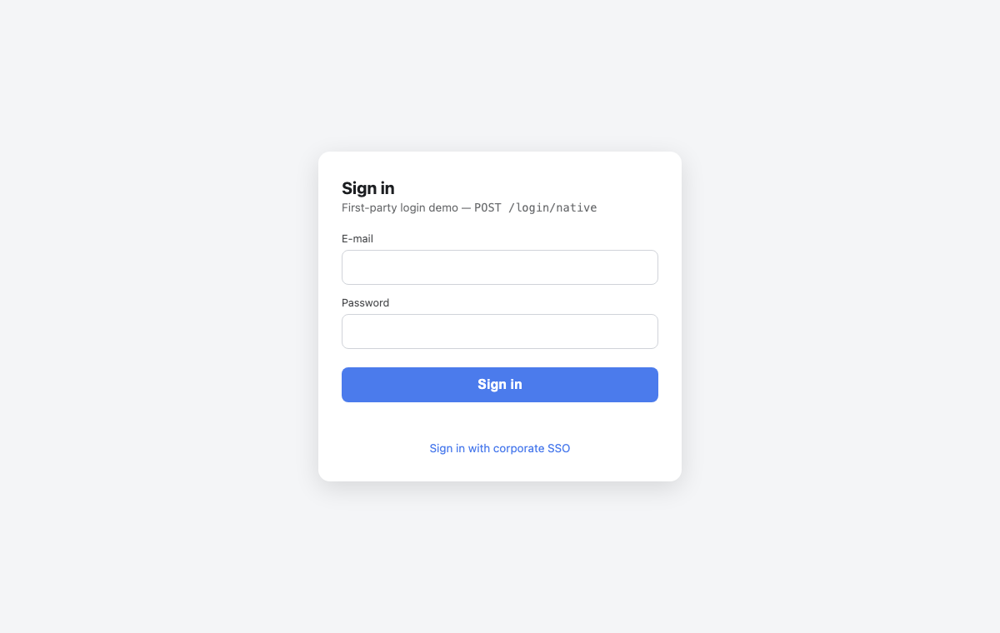
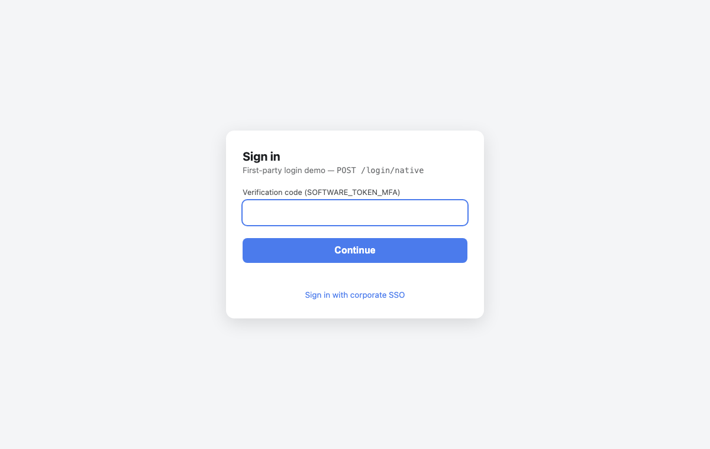

You have crafted every screen of your application. The colors are yours, the tone is yours, every label speaks your users' language. And then the user clicks Sign in - and lands on a page that belongs to somebody else.

Identity-provider hosted login pages are a great default, but they are style-only brandable, they speak a fixed set of languages with no text overrides, and they will never quite feel like your product. A Bulgarian-language production application drove this point home for us: everything around sign-in could be built in-app, but the credential form itself could not.

**Dirigible 14.30 closes that gap.** Applications on the OAuth2 profiles can now own the sign-in experience end to end - the provider-hosted page simply never renders.



## Native credential sign-in

The heart of the feature is one endpoint:

```
POST /login/native
Content-Type: application/json

{ "username": "jane.doe@example.org", "password": "..." }
```

The platform authenticates the credentials server-side against the identity provider and establishes the standard platform session - the same session the hosted flow creates, with the same principal, the same role mapping from the provider's groups, and the same provider-driven session re-validation. The browser receives only the session cookie; tokens never leave the server.

On the Cognito profile this runs over the **SRP protocol** (`USER_SRP_AUTH`): the password is used only to compute a zero-knowledge proof, so it never crosses the wire from the platform to AWS. No AWS SDK involved - pure JCA arithmetic against Cognito's published group parameters.

Multi-factor authentication is not an afterthought. When the provider requires another step - a TOTP code, an SMS code, a forced new password - the endpoint answers with a challenge, and the login page carries it through a simple round-trip:



Failures come back as **normalized outcome codes** (`INVALID_CREDENTIALS`, `PASSWORD_RESET_REQUIRED`, `TOO_MANY_ATTEMPTS`, ...), never provider-raw messages - so the application decides the wording, in every language it supports.

## One click to the corporate IdP

Federated users should not see a credential form at all. The authorization endpoint now forwards an allowlisted identity-provider hint, so a login page can deep-link straight to the corporate IdP:

```html
<a href="/oauth2/authorization/cognito?identity_provider=CorporateSSO">
  Sign in with corporate SSO
</a>
```

One click, and the browser goes directly to the SAML or OIDC provider - Cognito's `identity_provider` and `idp_identifier` hints and Keycloak's `kc_idp_hint` are supported.

## Your page at the front door

The last piece ties it together:

```bash
DIRIGIBLE_SECURITY_LOGIN_PAGE=/public/web/my-app/login.html
```

Unauthenticated browsers now land on your page instead of the provider's. Unset, nothing changes - the feature is fully opt-in. And because the page is plain web content served by the platform, it works everywhere your application does:

## Try it

- The reference login page - credential form, MFA round-trip, SSO deep link, in about a hundred lines of dependency-free HTML - lives at [dirigiblelabs/sample-native-login](https://github.com/dirigiblelabs/sample-native-login).
- The documentation covers the endpoint contract, the outcome codes and the setup recipe: [First-Party Sign-In](/help/setup/authentication/first-party-sign-in).
- The feature ships with [Eclipse Dirigible 14.30](https://github.com/eclipse-dirigible/dirigible/releases).

Your product, your language, your front door. Enjoy!
