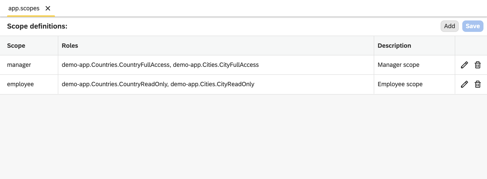

Scopes Editor
===

The **Scopes** editor lets you map OAuth2 scopes to one or more Dirigible roles through scope definition files (`*.scopes`). A single `*.scopes` file can hold multiple scope-to-role mappings.

Scope mapping enables **OAuth2 Client Credentials (machine-to-machine, M2M) authorization**. M2M tokens carry no user, no groups and no id token — the only access signal they provide is the `scope` claim. The Scopes editor is where you declare how those scopes translate into the roles that protect your endpoints.



::: tip
Scopes are only needed when a single scope must grant **several** roles, or when you want an explicit, named mapping. When a scope maps one-to-one to a role of the same name, no `*.scopes` file is required — see [How scope mapping works](#how-scope-mapping-works) below.
:::

## Create a Scopes Definitions File

1. Right-click on your project in the **Projects** view and choose **New** **&rarr;** **Scopes Definitions**.

2. Enter a name for the scopes file (the `.scopes` extension is added automatically).

A new file is created, pre-populated with a couple of example mappings:

```json
[
    {
        "scope": "administration",
        "roles": [
            "ADMINISTRATOR"
        ],
        "description": "Administration scope"
    },
    {
        "scope": "operations",
        "roles": [
            "ADMINISTRATOR",
            "OPERATOR"
        ],
        "description": "Operations scope"
    }
]
```

## Create a Scope Mapping

1. Double-click on your scopes file to open it in the **Scopes** editor. The editor shows a table of the defined mappings with **Scope**, **Roles** and **Description** columns.

2. Click on the **Add** button.

3. In the dialog, fill in:

    - **Scope** — the bare scope name (see [Scope name resolution](#scope-name-resolution)).
    - **Roles** — one or more Dirigible role names that the scope grants.
    - **Description** — an optional, human-readable description of the scope.

4. Confirm to add the mapping to the table.

5. Use the **edit** and **delete** actions on each row to maintain existing mappings.

6. Click **Save**.

When the file is saved and synchronized, the scope mappings are registered with the security engine and become available to the resource-server providers.

## The `*.scopes` artifact

A `*.scopes` file is a JSON array of scope mapping objects:

| Field | Required | Description |
|---|---|---|
| `scope` | yes | The bare scope name to map. |
| `roles` | yes | An array of one or more Dirigible role names the scope grants. |
| `description` | no | A human-readable description of the scope. |

Example:

```json
[
    {
        "scope": "orders-manage",
        "roles": [
            "sample-app.Orders.OrderFullAccess",
            "sample-app.Orders.OrderReadOnly"
        ],
        "description": "Manage orders"
    },
    {
        "scope": "athena-admin",
        "roles": [
            "ADMINISTRATOR"
        ]
    }
]
```

## How scope mapping works

When a request arrives with an OAuth2 Bearer (resource-server) token, the token is first validated as usual (signature, issuer, JWK set). Scope mapping does **not** affect validation — it only derives authorities from the already-validated claims.

The `scope` claim (or the alternative `scp` claim) is read. It may be either a space-delimited string or a list of values. Each raw scope value is then resolved to Dirigible role names:

1. **Scope name resolution** — the bare scope name is extracted (see below).
2. **Mapping lookup** — if the bare scope name has an entry in a `*.scopes` artifact, it expands to **all** the role names declared there.
3. **1:1 fallback** — if the scope name has no mapping, it falls back to a one-to-one mapping where the scope name **is** the role name.

The resulting role names are turned into the same `ROLE_` authorities used for interactive (user) sessions, so role-protected endpoints authorize M2M requests exactly as they do user requests.

### Scope name resolution

Some authorization servers qualify custom scopes with a resource-server prefix. For example, AWS Cognito issues scopes as `<resource-server-identifier>/<scope-name>`, where the resource-server identifier carries a generated random suffix.

- The **bare scope name** is the substring after the **last** `/` in the raw scope value.
- Standard OIDC scopes that contain no `/` (such as `openid`, `email`, `profile`, `aws.cognito.signin.user.admin`) are **not** treated as roles and are ignored.

So a raw scope of `my-resource-server-a1b2c3/orders-manage` resolves to the bare name `orders-manage`, which is then looked up in your `*.scopes` mappings (or falls back to the `orders-manage` role).

## Supported providers

Scope-to-role mapping is applied by the OAuth2 resource-server security configurations and is shared by every provider, including:

- **AWS Cognito**
- **Keycloak**

::: info Related content

* [Access Editor](./editor-access)
* [Scopes View](./views/scopes)
* [Roles View](./views/roles)
* [Artifacts Overview](../artifacts/)
:::
