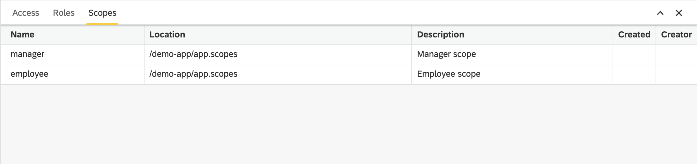

Scopes View
===

The **Scopes** view lists all scope-to-role mappings defined in the scope descriptors `*.scopes`. Each mapping associates an OAuth2 scope with one or more Dirigible roles, enabling machine-to-machine (M2M) authorization. The view is available in the **Security** perspective, alongside the [Roles](./roles) and [Access](./access) views.

More info about the type of the artifacts you can find in [Artifacts](../../../artifacts/).

::: info Related content

* [Scopes Editor](../editor-scopes)
* [Roles View](./roles)
* [Access View](./access) :::
