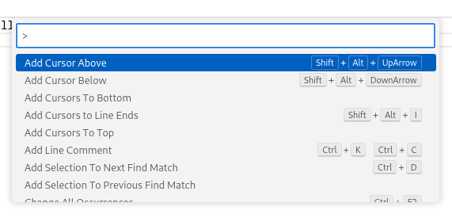

# Keyboard Shortcuts

The IDE inherits Monaco's shortcuts for editing operations and layers a small set of workbench-level bindings on top.

## Workbench

| Combination                              | Action            |
|------------------------------------------|-------------------|
| `F1`                                     | Command palette   |
| `Ctrl+S` / `Cmd+S`                       | Save              |
| `Ctrl+Shift+I` / `Cmd+Shift+I`           | Format document   |
| `Ctrl+Shift+F` / `Cmd+Shift+F`           | Search popup      |

## Command palette

The command palette (`F1`) lists every editor command available in the active editor, with its keyboard binding and a search box on top. Use it to discover and run commands without leaving the keyboard.

