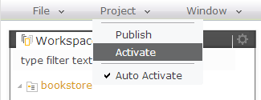
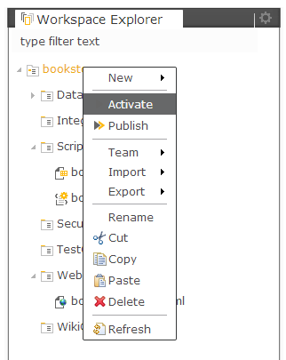

Activation
===

Activation is a concept related to development life-cycle of the application.
The original sources are stored in the workspace of the user. All the changes reflect direclty the source artifacts there. When the source artifact is already in the state, which can be executed (i.e. tested) the developer has to perform *activation* on the project level.
This will transfer (copy) the source artifacts from the workspace to the *sandbox*. This place is fully functional runtime container, isolated for the current user only. The difference between the *sandbox* and the *registry* space is the user isolation only.

Activation action is accessible from the main menu under the Project section or at the project's pop-up menu in the Workspace Explorer

or

<code> 
   /db
     /dirigible
       /sandbox
         /<user>             (private space)
           /ScriptingServices
             /project1
               /service1.js
       /users
         /<user>             (private space)
           /workspace
             /project1
               /ScriptingServices
                 /service1.js
</code>

> The scripting services in the sandbox can access the services from the registry, but not vice versa

There is default *auto-activation* mechanism, which can perform the activation on save of the artifact. This can be switched on/off from the main menu -> Project (if you are in the Workspace perspective)

The auto-activation is enabled only for:

*	Scripting Services
*	Web Content
*	Wiki Content
 
For:

*	Data Structures
*	Security Constraints
*	Integration Services
*	Extension Definitions

there is no sandboxing supported as well as auto-activation. The activation process is equal to [publication](publication.html) in this case.

