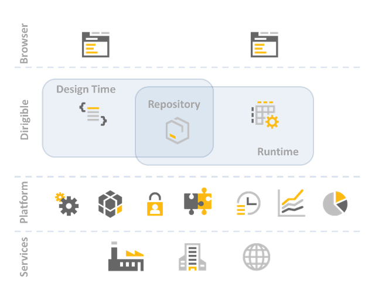

Architecture
===

Dirigible architecture follows the well proved principles of simplicity and scalability in the classical service-oriented architecture.

There is separation of components for design time (definition work, modeling, scripting) and the runtime (execution of services, content provisioning and monitoring).
The transition between the design time and runtime is via repository component and the only linking part is the content itself.

At design time the programmers and designers use the Web-based integrated development environment. This tooling is mainly based on the Remote Application Platform (RAP) from Eclipse. Using this robust and powerful framework the tooling itself can be easily enhanced by using well known APIs and concepts - SWT, JFaces, OSGi, extension points, etc.

The Repository is the container of the project artifacts. It is a generic file-system like content repository on relation database.

After the creation of the cloud application, it is provided by the runtime components. The main part is Java Web Profile compliant application server. On top are the Dirigible's containers for services execution depending on the scripting language and purpose - Rhino, jRuby, Groovy, Camel, CXF, etc. The runtime can scale independently by the design time part, and even can be deployed without design time at all (for productive landscapes)

Depending on the target cloud platfrom, Dirigible can be integrated to use the services provided by the underlying platfrom.

