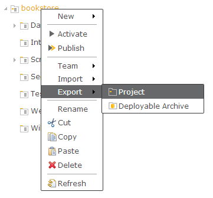
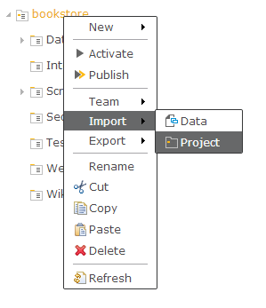
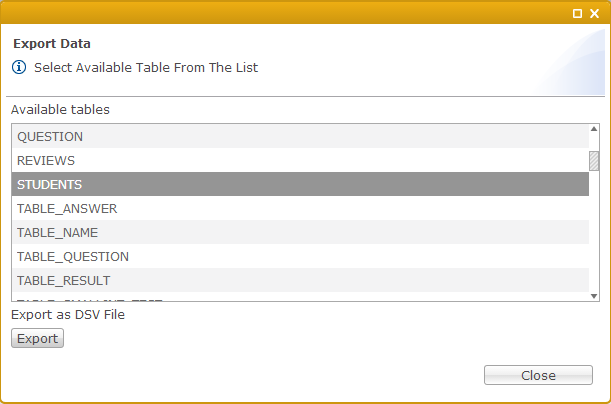

Backup - Project Import and Export
===

There is a possibility to export and import content of a given project or multiple projects as a zip archive for e.g. backup purposes. This is the simplest yet fastest way to transfer project content to Dirigible.
The actions are available thru the main or pop-up menu

Export

and Import

> You can use this functionality also in cases of mass import of project artifacts - e.g. images in the web content

> This feature can be used also for import of sample projects from public sources or sharing of projects between accounts, although for real team source management the recommended aproach is via [Git|git.wiki].

Backup Data
---

Except creating backup of the project it is good practice to have backup of the content.
This can be easily done by exporting tables data into *.dsv* files.

