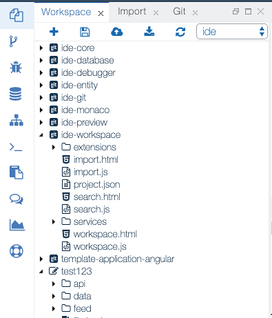

{{ page.title }}
===

The **Workspace** is the developer's place where he/she creates and manages the application artifacts. The first-level citizens of the *workspace* are the *projects*. Each project can contain multiple folders and files (artifacts).

A single user can have multiple workspaces, containing different set of projects.

The artifacts i.e. the project management, can be done via the views and editors in the [Workbench Perspective](ide_perspective_workbench.html).

{: .img-responsive }
