Debugging
===

The toolkit offers *Debug* functionality. The goal is to facilitate developers in the hunt of server-side bugs.

###Debug Perspective###

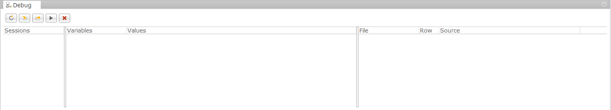

*	*Sessions* - contains all debug execution sessions.
*	*Variables/Values* - contains variables and their values, available in the current scope of execution.
*	*File/Row/Source* - contains inforamation about in witch file and witch row, a *Breakpoint* is set. 

###Available Commands###

*	 Refresh
*	 Step Into
*	 Step Over
*	 Continue
*	 Skip all breakpoints

###Example###

###Step 0 - Project Structure###

**simple_service.js**:
<pre><code>
main();

function main(){
    var message = createMessage();
    var students = createStudents();
    response.getWriter().println(message);
    response.getWriter().println(JSON.stringify(students));
}

function createMessage(){
    var initialValue = 1;
    var endValue = startCounter(initialValue);
	var message = 'Initial value was '+initialValue+', end value is '+endValue;
    return message;
}

function startCounter(value) {
    for(var i = 0; i < 5; i++){
        value ++;
    }
	return value;
}

function createStudents(){
    var students = [];
    students.push(createStudent('Desi', 18));
    students.push(createStudent('Jordan', 21));
    students.push(createStudent('Martin', 22));
    return students;
}

function createStudent(name, age){
    var student = {};
    student.name = name;
    student.age = age;
    return student;
}
</code></pre>

**library_jslib**:
<pre><code>
exports.generateGuid = function() {
    var guid = ''+uuid.randomUUID();
    return guid;
};
</code></pre>

**require_service.js**:
<pre><code>
var guidGen = require('/DebuggerDemo/library');
var user = 'Test User';
var id = guidGen.generateGuid();

response.getWriter().println(user+", id "+id);
response.getWriter().flush();
response.getWriter().close();
</code></pre>

###Step 1 - Open Debug Perspective###

1. Click *other...* to list available perspectives.
  

  
2. From the list, select *Debug*.
  
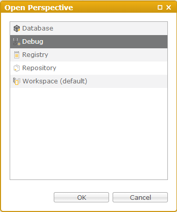
  
3. The *Debug* perspective is open.
  

###Step 2 - Start Debugging###

1. From *Workspace Explorer*, select *simple_service.js*.
  

  
2. Debugger was started and waits for user interaction.
  

  
3. In the *Debug* view, press the *Refresh*  button to list available debug sessions and select one.
  
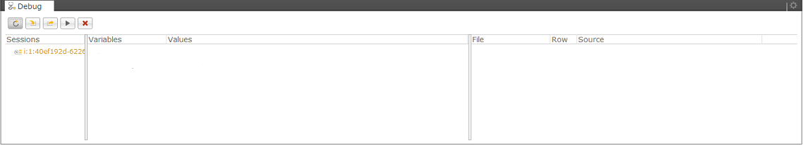
  
4. Press the *Step Into*  button to continue with script execution.
  
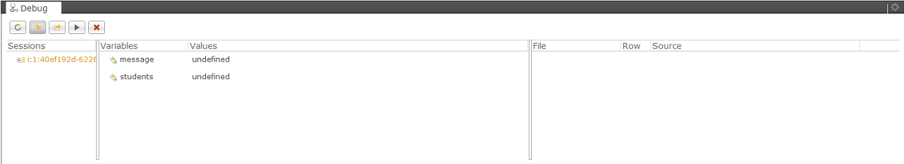
  
5. Set some *Breakpoints*.
6. Click on the line numbers on the left side of the opened editor.
7. Press the *Refresh*  button to see *Breakpoints* that were set.
  
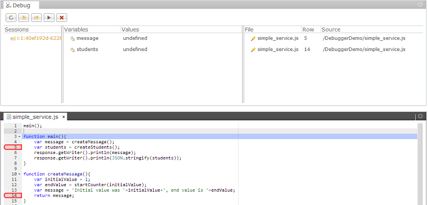
  
8. Press the *Continue*  button to resume script execution to the next breakpoint.
  
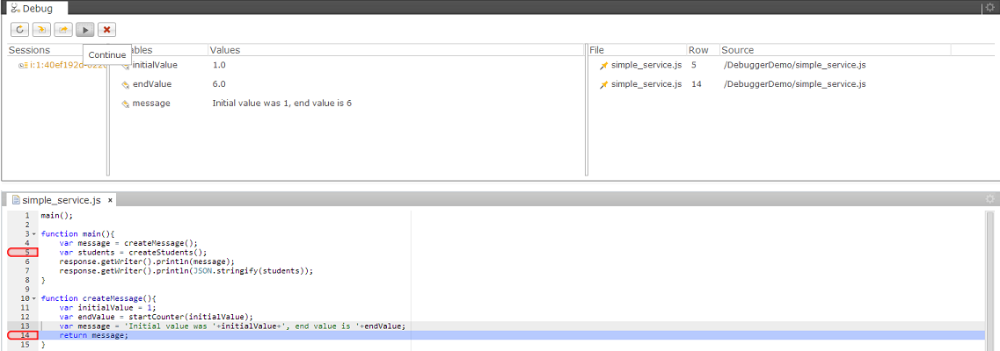
  
9. Press the *Continue*  button again.
  
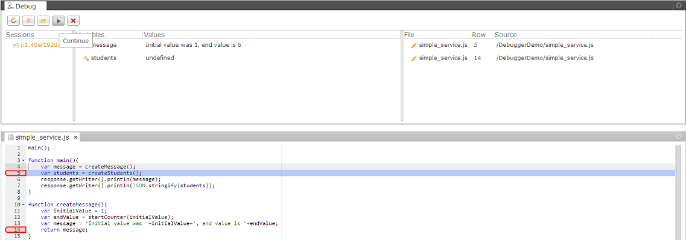
  
10. To exit the *Debug Session*, press the *Skip all breakpoints*  button or continue pressing *Step Over*  or *Step Into*  until the script execution finishes.

###Step 3 - Debugging Scripts Requiring Libraries###

1. From *Workspace Explorer*, select *require_service.js*. 
  
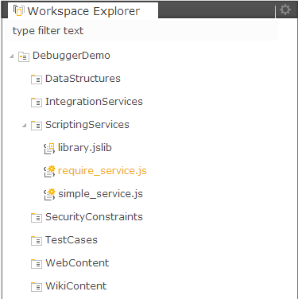
  

  
2. A new *Debug Session* is started.
3. Press the *Refresh*  button, select a session and 
press *Step Into* .
  
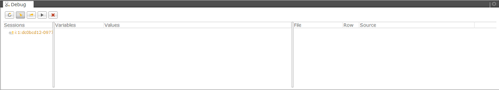
  
4. Continue debugging.
  
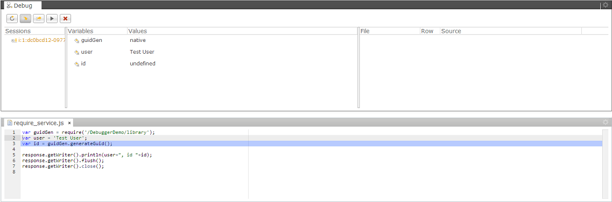
  
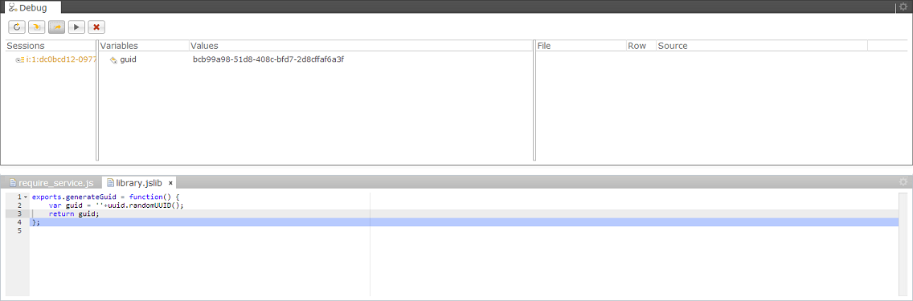
  