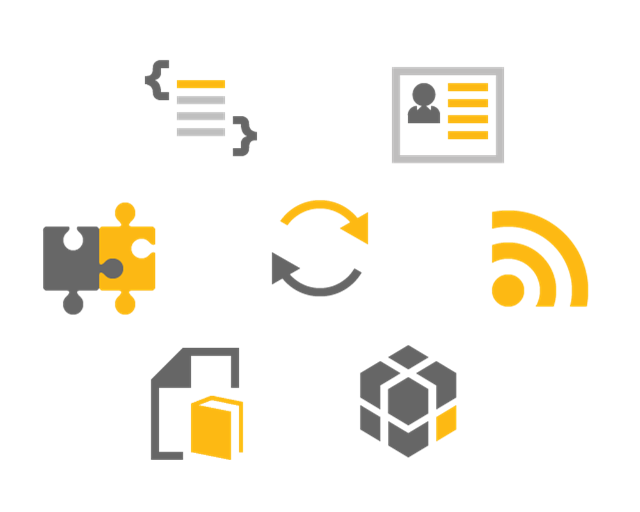

Dynamic Applications
===

We introduced the term *Dynamic Applications* as one that narrows the scope of the target applications, which can be created using *Dirigible*.
The overall process of building Dynamic Applications lies on well-known and proved principles:

*	[In-System Development](http://en.wikipedia.org/wiki/In-system_programming) - known from microcontrollers to business software systems. Major benefit is working on a live system where all the changes made by a developer take effect immediately, hence the impact and side-effects can be realized in very early stage of the development process.
*	*Content Centric* - known from [networking](http://en.wikipedia.org/wiki/Named_data_networking) to [development processes](http://en.wikipedia.org/wiki/Domain-driven_design) in context of Dynamic Applications it comprises all the artifacts are text-based models or executable scripts stored on a generic repository (along with the related binaries such as images). This makes the life-cycle management of the application itself as well as the transport between the landscapes (Dev/Test/Prod) straight forward. 
In addition, desired effect is the ability to setup the whole system, only by pulling the content from a remote source code repository, such as git.
*	[Scripting Languages](http://en.wikipedia.org/wiki/Scripting_language) - programming languages written for a special run-time environment that can interpret (rather than compile) the execution of tasks. Dynamic languages existing nowadays as well as the existing smooth integration in the web servers make possible the rise of the in-system development in the cloud.
*	*Shortest turn-around time* - instant access and instant value became the most important requirement for the developers, that's why it is also the driving principle for our tooling.

In general, a Dynamic Application consists of components, which can be separated to the following categories:

*	*Data Structures*
These are the artifacts representing the domain model of the application. In our case, we have choosen the well accepted JSON format for describing the normalized entity model.
There is no intermediate adaptation layer in this case, hence all the entities represent directly the database artifacts - tables and views.
*	*Entity Services*
Once we have the domain model entities, next step is to expose them as web services. 
Following the modern web patterns we provide the scripting capabilities, so you can create your RESTful services in JavaScript, Ruby and Groovy.
*	*Scripting Services*
During the development you can use rich set of [APIs](api.html) which give you access to the database and HTTP layer, utilities as well as direct Java APIs underneath.
Support for creating unit tests is important and it is integrated as atomic part of the scripting support itself - you can use the same language for the tests, which you are using for the services themselves.
*	*User Interface*
Web 2.0 paradigm as well as HTML5 specification bring the web user interfaces on another level. There are already many cool client side ajax frameworks, which you can be used depending on the nature of your application.
*	*Integration Services*
Following the principle of atomicity, one Dynamic Application should be as self-contained as possible. Unfortunately, in the real world there are always some external services that have to be integrated to your application - for data transfer, triggering external processes, lookup in external sources, etc.
For this purpose we provide capabilities to create simple routing services and dynamic EIPs.
*	*Documentation*
The documentation is integral part of your application. The target format for describing services and overall development documentation is already well accepted - wiki.

