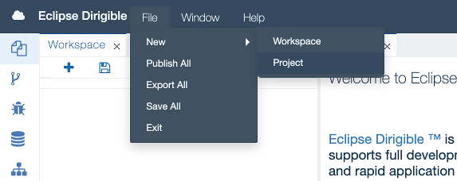
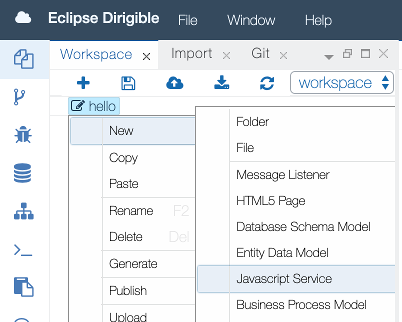

{{ page.title }}
===

### Preamble

This guide explains how to setup an Eclipse Dirigible instance and how to use it to build your very first *hello-world.js* service. The references section below points to the documentation with more technical details for the different aspects of the platform and its components and capabilities.

### Setup

##### Get the binary

* In case you want to use a prebuild package, you can get the one built for your environment from the [downloads](https://download.eclipse.org/dirigible) section.
* To build Eclipse Dirigible from sources by yourself, just follow the instructions in the [README](https://github.com/eclipse/dirigible/blob/master/README.md#build).

##### Choose the environment

* You can choose one of the [options](setup.html) available to get an Eclipse Dirigible instance depending on your target environment.
* A shared trial instance is also available and can be accessed from here: [http://trial.dirigible.io](http://trial.dirigible.io).

There are many [configuration options](setup_environment_variables.html), so you can connect to different databases, use different platforms, choose a specific set of plugins, and many more.

##### Access the instance

In case of the standard setup on Apache Tomcat on your local machine, you can point your browser to the location:

> http://localhost:8080

### Write the *hello-world.js* service
Once you have a running Eclipse Dirigible instance, you can start with your project:

1. Choose `File -> New -> Project`.

    

2. Enter a name and create the project. 

    

3. Right-click on the project icon in the `Workspace` view and choose `New -> Javascript Service`.

    

4. Enter a name for the service.
5. Double-click on the file icon to open the file in the editor on the right. The file already contains the *hello world* service implementation.

    

6. Right-click on the project icon and choose `Publish`.

    

7. With the file icon selected in the `Workspace` view, check the result of the execution of our fancy server-side Javascript service in the `Preview` view.

    

### Update the *hello-world.js* service

1. Go to line 3 in the editor and change:

    > Hello World!

    to

    > Hello Dirigible!

2. Save the file (Ctrl+S for Windows, Command+S for Mac). 
    
The output in the `Preview` view changes immediately. This is due to the default configuration of *auto-publish* on *save*. You can find more about this *dynamic* behavior in the concepts section: [Dynamic Applications](concepts_dynamic_applications.html)

### References

* So far we saw how easy it is to create and modify a RESTful service. You can find more samples [here](../samples/index.html). 
* If you would like to know more about how to write complex services, you can go to the [API](../api/index.html) section. 
* If you are curious what you can do with Eclipse Dirigible apart from writing server-side Javascript services, you can have a look at the [features](features.html) section.
* In case you are interested of modeling and generation features in the Low Code/No Code, you can read about [entity data models](concepts_entity_service.html) and [generation capabilities](concepts_generation.html).

