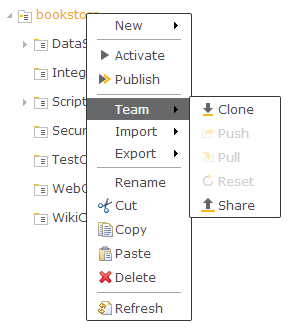

Git Integration
===

There is a Git connector for team development in the cloud toolkit. 
Goal: providing the simplest way to synchronize sources with the remote source control repository, and to leave the more complex operations (e.g. merging) for external tools.

###Available Commands### 

*	*Clone* - clones remote Git repository to the toolkit as a project.

> Constraint: Remote Git repository must contain only one project.

*	*Push* - tries to push changes to the project's remote repository. 
	* If the changes are not conflicting with what is in remote "origin/master" branch, the push is successful. After that, the project content is synchronized with the state in the remote "origin/master" branch. 
	* If there are conflicts with the newly made changes, a new remote branch is created and changes are pushed in it. The remote branch name is "**changes_branch_<dirigible's username>**", e.g. _**changes_branch_user1234**_.

> Constraint: Merging of conflicting branches should be done via an external tool, e.g. "GitBash", "eGit", etc.

*	*Pull* - check outs the remote changes from the "origin/master". If there are conflicts, an error occurs.

> Constraint: If there are conflicting changes during Pull, the recommendation is to first [backup](backup.wiki) the project as ZIP, then to reset it, and then to manually apply your changes again.

*	*Reset* - sets the local project to be as the latest state of the remote "origin/master" branch.

*	*Share* - shares the selected project to a remote repository.

All the commands are accessible from the project's context menu.

