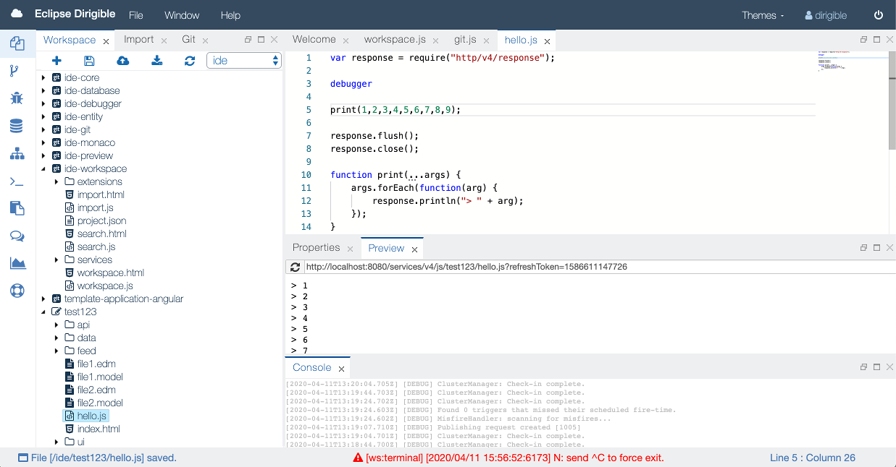

{{ page.title }}
===

### Web IDE

The environment runs directly in a browser and therefore does not require additional downloads and installations. It has a rich set of editors, viewers, wizards, devops productivity tools, and a new cloud IDE for in-system application development.

The IDE is a composition of perspectives, each consisting of the necessary tools to accomplish certain goal. Three areas are with fixed positions:

* top-area toolbar for the menus, theme selection and user control;
* sidebar to the left with shortcuts to the perspectives;
* status bar at the bottom, for notifications and other use by the tools.

The tools that constitute the perspectives are laid out in predefined regions of the work plot, but their position can be changed by using drag and drop. The perspectives are simply predefined configurations, hence different tools may be opened, moved, or closed on the work plot of a perspective for the users’ convenience. The tools can also be maximized, minimized, or even popped out in a separate window.
 
The tools are the minimal atomic parts in the IDE. They are referred to as views or editors and each type is handled differently.

### Perspectives

By default, the different views and editors are separated into a few perspectives:

* [Workbench](ide_perspective_workbench.html)
* [Git](ide_perspective_git.html)
* Database
* Repository 
* Terminal

### Editors
The editors that have been integrated into the Dirigible IDE are [Orion](http://orionhub.org), [Ace](http://ace.c9.io) and [Monaco](https://microsoft.github.io/monaco-editor/). More sophisticated and visual editors are included in the pipeline.

### Layouts

The cloud IDE layout API delegates the layout management to the GoldenLayout framework. Layouts is a convenience bag of functions that significantly simplifies the work with layouts. It takes care of views registry setup, the work plot regions configuration, layout initialization, serialization, control on the layout manager, open view and open editor functions, global notifications and others.

The Toolbar is a composite that aggregates the drop-down menus, the theme selection, the user name and sign-out control. It uses the corresponding UI microservices available in the ideUiCore module as Menu, User and Theme.

By convention, all UI components are built with Bootstrap 3.x CSS and the themes in the cloud IDE are actually custom Bootstrap CSS. A UI microservice enables dynamic change of the CSS upon change of the theme automatically. It is available as Angular Factory Theme.

The Angular Service User provides the details for the user that are rendered by the Menu directive, such as the user name.

The sidebar is Angular directive that takes care of rendering a standard sidebar in the framework template. It works with the perspectives.js service to populate the registered perspectives as shortcuts.

The status bar is an Angular directive that renders a standard, fixed-position footer. The component is subscribed to listen to message types configured as value of the status-bar-topic attribute, or by default to status-message messages.
 
