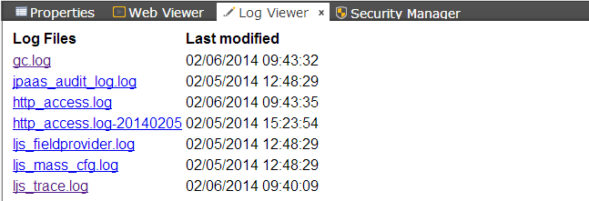
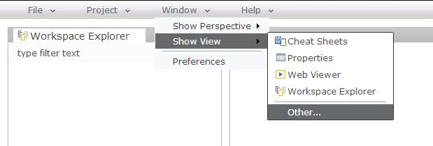
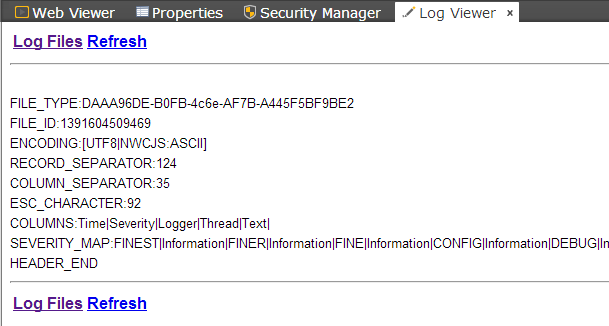

Log Viewer
===

It lists all available log files.

1. If the *Log Viewer* is not available, navigate to *Window* -> *Show View* -> *Other...*
  

  
2. From *Workspace*, select folder *Log Viewer*.
  

  
3. Now the *Log Viewer* is available.
  

  
4. Open any log file, for example, *ljs_mass_cfg.log*.
  

  

**Log Files** - goes back to the list of available log files

**Refresh** - refreshes the content of the opened log file (needs to be pressed if new logging event occurred)

For more information about the server-side logs and configurations, see [Logging Service](service_logging.html).
