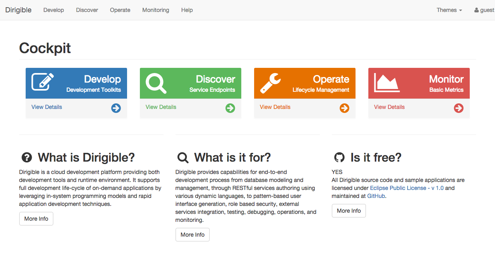

Registry
===

The entry point of the searching and browsing of the service end-points as well as monitoring and administration at runtime phase is the Registry.
Technically it is a space within the Repository where all the [published](publishing.html) artifacts are placed.

To access the user interface you can point to the runtime context - default one is "dirigible"

> *http //[host]:[port]/dirigible*

End-points
---

From the index page of the Registry, you can navigate to the corresponding sub-pages for browsing the raw content of the Repository, 
published [user interfaces](web_content.html) (html, css, client-side javascript, etc.), [documentation[(wiki_content.html) of the applications, lookup the end-points 
of the [scripting services](scripting_services.html) as well as the end-points of the integration services.

Monitoring Tools
---

The last phase of the applications life-cycle includes administration and monitoring.

Via the Registry interface you can navigate to the monitoring tools including:

*	Hit Count Statistics
*	Response Time Statistics
*	Memory Allocations
*	Log Traces

The URIs on which you want to collect information about the request parameters have to be registered in the Manage Access Locations section.
