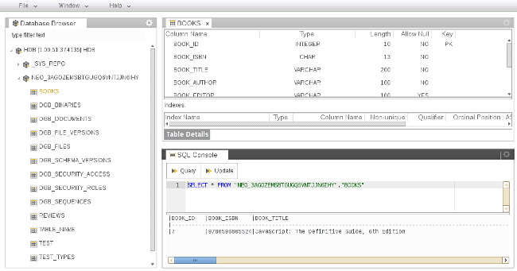

SQL Console
===

Generic and in the same time most powerful and most dangerous tool for database management - SQL Console.

There are two separated areas - at the top you can enter the SQL script compliant to the underlying database system.
At the bottom - you get the result of the execution in fixed text format.

There is also separation between the *Query* and *Update* statements, which the user can execute depending on his/her roles.
