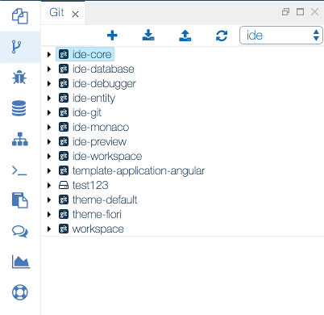

{{ page.title }} View
===

The Git view enables the users to perform simple git operations such as cloning a repository to a workspace, pulling changes, and pushing commits. The user can create, manage, and switch between multiple workspaces through the Workspace menu.

{: .img-responsive }

