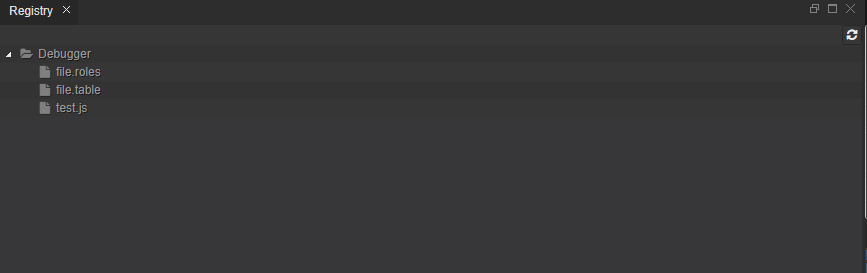

{{ page.title }} View
===

Technically, the **Registry** is a space within the *Repository* where all the [published](concepts_publishing.html) artifacts are placed.

{: .img-responsive }

> Caution: Editing of the file contents via the Registry perspective is not recommended as it can lead to inconsistencies!
