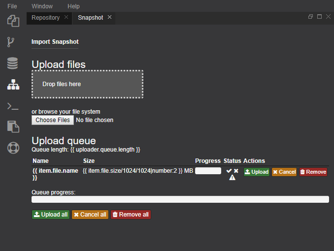

{{ page.title }} View
===

The Snapshot view enables the user to upload the whole repository (including all users Workspaces) and all registry public contents. It includes a progress bar for navigation of the process.

{: .img-responsive }

