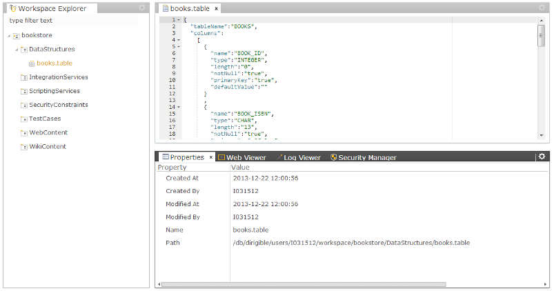

BookStore
===

The *BookStore* sample demonstrates how you can build a simple online shop. It shows how to create a domain model in the target database, how to generate RESTful services on top of the modeled entities, and finally how to generate simple management user interface as a basis for the actual Web design.

Project Creation
---

1. First, open the perspective where you want to create a project. The **Workspace** perspective is the default one.
2. From the main menu, select *File* -> *New* -> *Project*.

<br>


<br>

3. In the wizard, enter the project name **bookstore** and click *Next*.
4. From the list you can choose from several predefined project templates. In this case, just go to the first one - **Blank Dynamic Application**.
 
<br>


<br>

5. Click *Finish* and open the project in the workspace to see the folder layout.
<br>


<br>

There are several predefined folders, tightly related to the artifact types, which can be placed there as well as the corresponding activities you can make on them.


Data Model
---

Data models a.k.a [domain models](http://en.htmlpedia.org/wiki/Domain_model) is the set of entities of your application and also their relations.
In Dirigible, we use also the term [data structures](../help/data_structures.html), which is more related to the actual artifact - the data descriptor.
Let's create the first model entity of the [BookStore](bookstore.html) sample - the books table.

1. Select the *DataStructures* sub-folder of a project and open the pop-up menu using right-click.
2. From the menu, go to *New* -> *Data Structure*.

<br>


<br>

The first page of this wizard lets you choose from several artifacts related to the domain model. In this case, we need a table to store the books' metadata, such as ISBN, Title, Author, etc.
3. Choose **Database Table** and click *Next*.

<br>


<br>

4. Use the *Add*/*Remove* buttons to create the actual table layout.

<br>


	BOOK_ID                 INTEGER         not null    primaryKey
	BOOK_ISBN               CHAR        13  not null
	BOOK_TITLE              VARCHAR     200 not null
	BOOK_AUTHOR             VARCHAR     100 not null
	BOOK_EDITOR             VARCHAR     100
	BOOK_PUBLISHER          VARCHAR     100
	BOOK_FORMAT             VARCHAR     100
	BOOK_PUBLICATION_DATE   DATE
	BOOK_PRICE              DOUBLE          not null


<br>

5. Give a name and click *Finish*.

<br>


<br>

The table descriptor should be generated based on your input, and the file itself should be opened in the editor's area.

<br>



```javascript

	{
	  "tableName":"BOOKS",
	  "columns":
	    [
	      {
	        "name":"BOOK_ID",
	        "type":"INTEGER",
	        "length":"0",
	        "notNull":"true",
	        "primaryKey":"true",
	        "defaultValue":""
	      }
	      ,
	      {
	        "name":"BOOK_ISBN",
	        "type":"CHAR",
	        "length":"13",
	        "notNull":"true",
	        "primaryKey":"false",
	        "defaultValue":""
	      }
	      ,
	      {
	        "name":"BOOK_TITLE",
	        "type":"VARCHAR",
	        "length":"200",
	        "notNull":"true",
	        "primaryKey":"false",
	        "defaultValue":""
	      }
	      ,
	      {
	        "name":"BOOK_AUTHOR",
	        "type":"VARCHAR",
	        "length":"100",
	        "notNull":"true",
	        "primaryKey":"false",
	        "defaultValue":""
	      }
	      ,
	      {
	        "name":"BOOK_EDITOR",
	        "type":"VARCHAR",
	        "length":"100",
	        "notNull":"false",
	        "primaryKey":"false",
	        "defaultValue":""
	      }
	      ,
	      {
	        "name":"BOOK_PUBLISHER",
	        "type":"VARCHAR",
	        "length":"100",
	        "notNull":"false",
	        "primaryKey":"false",
	        "defaultValue":""
	      }
	      ,
	      {
	        "name":"BOOK_FORMAT",
	        "type":"VARCHAR",
	        "length":"100",
	        "notNull":"false",
	        "primaryKey":"false",
	        "defaultValue":""
	      }
	      ,
	      {
	        "name":"BOOK_PUBLICATION_DATE",
	        "type":"DATE",
	        "length":"0",
	        "notNull":"false",
	        "primaryKey":"false",
	        "defaultValue":""
	      }
	      ,
	      {
	        "name":"BOOK_PRICE",
	        "type":"DOUBLE",
	        "length":"0",
	        "notNull":"true",
	        "primaryKey":"false",
	        "defaultValue":""
	      }
	    ]
	}

```

<br>

More information about data structure types and their descriptors can be found here: [Data Structures](../help/data_structures.html)

<br>

6. Now, we have to create the real database artifact in the underlying database. This can be done via *Publish* action from the project's pop-up menu.

<br>


<br>

In this case (data structures artifacts), you can do the same using activation action. For more information about the differences between these two operations, see [activation](../help/activation.html) and [publishing](../help/publishing.html).

<br>

Once we have published successfully the project, we can go to **Database** perspective to double-check the table definition.
7. From the main menu, go to *Window* -> *Show Perspective* -> *Database*.

<br>


<br>

8. Open the database schema node and find the **BOOKS** table. 

<br>


<br>

9. Right-click and choose *Open Table Definition*. This will open **Table Definition Viewer**.

<br>


<br>


Entity Service
---

In the context of Dirigible, the Entity Service is a RESTful service which exposes the [CRUD](http://en.wikipedia.org/wiki/Create,_read,_update_and_delete] methods on top of the database table.
The following steps show how to generate such an entity service:

1. Select the **ScriptingServices** sub-folder of the project and open the pop-up menu.
2. From the menu, go to *New* -> *Scripting Service*.

<br>


<br>

3. From the wizard, select **Entity Service on Table** from the list of available templates.
<br>


<br>

4. Click *Next*. The displayed page is a specific one, it lists all available tables from the current database schema.
<br>


<br>

5. On the next page, give a name of your entity servicee and click *Finish*.
<br>


<br>

6. The generated service should be opened in the editor's area.
<br>


<br>

Now, we can use activation action to enable the service.
7. From the project's pop-up menu, select *Activate*.

<br>


<br>

8. During the activation, the artifact goes to the sandbox of the logged-in user. We can see the result of the service calling right away in the *Preview* (should be opened by default in the **Workspace** perspective, next to *Properties* view). Now go to the *Workspace Explorer*, where the project is managed, and select the service artifact (**books.js**). This will trigger the construction of the correct URL of the service endpoint in the sandbox, hence you will see the result in the *Preview*.

<br>


<br>

In this case - just an empty JSON array.
9. If you like the result to be in the sandbox, you can publish the service so that it becomes accessible by the other users. 

<br>


<br>

10. To find the URL, you can go to the **Registry** perspective. (From the main menu, go to *Window* -> *Show Pespective* -> *Registry*.)

<br>

11. The **Registry** perspective represents a view to the enabled runtime content. From its menu, choose *Scripting* -> *JavaScript* to open the currently available server-side JavaScript service endpoints.

<br>


<br>

12. You can see the list of available end-points. You can find yours by the naming convention: **<project>.<service path>**

<br>


<br>

13. The link to the service can be copied to clipboard via the first image at the right side of the row, or can be directly opened by clicking on the second image.

<br>


<br>

The naming convention for the service endpoints' URLs is as follows:

> *[protocol]://[host]:[port]/[dirigible's runtime application context]/[scripting container mapping]/[project]/[service path]*

>  **For example:**

> *https ://dirigibleide.hana.ondemand.com/dirigible/js/bookstore/books.js*

The scripting containers mappings are:

<ul>
	<li>JavaScript
		<ul>
    		<li> /js </li>
    		<li> /js-secured </li>
    	</ul>
    </li>
	<li> Ruby
   		<ul>
     		<li> /rb </li>
     		<li> /rb-secured </li>
     	</ul>
    </li>
	<li> Groovy
   		<ul>
      		<li> /groovy </li>
      		<li> /groovy-secured </li>
      	</ul>
    </li>
	<li> Test
   		<ul>
     		<li> /test </li> 
     	</ul>
    </li>
 </ul>

The suffix "<samp>-secured</samp>" above shows the access point for the secured end-points. For more information, see [Security](../help/security.html).

There are specific requirements in order for a table to be exposed as an entity service (e.g. primary key has to be defined, it should be a single column, etc.).
Also, the entity service itself supports a bit more operations than the standard ones defined by HTTP. For more information, see [Entity Services](../help/entity_service.html).


Entity User Interface
---

After the creation of the data model and the entity service, we are going to generate user interface for entity management (list, new, edit, delete...)

1. Select the *books.entity* and open the pop-up menu. Choose *Generate* -> *User Interface for Entity Service*.

<br>


<br>

2. From the wizard, select template **List and Manage View**.
<br>


<br>

3. Click *Next*.
4. Select all the columns from the list. You can use *Select All*.

<br>


<br>

5. On the next page, enter the name **books_manage.html**.
<br>


<br>

6. For *Title* on the next page, you can enter **Manage Books**.
<br>


<br>

7. Click *Finish*. 
8. The generation is triggered. You can see the result under the **WebContent** folder.
9. When you select the file with active *Preview*, you should see the result running page.
<br>


<br>

For the real test of the Web page and the entity service, you can [Publish](../help/publishing.html) the project.
<br>


<br>

or

<br>


<br>

Now, you need to switch to the **Registry** perspective to find the link to the page, so that you can open it in an external browser.
11. From the **Registry** embedded page menu, choose *Web* -> *Content*.

<br>


<br>

12. Drill-down in the **BookStore** project folder and click on the page which is listed.
13. To open the page in a new tab, click on the icon on the right side
<br>


<br>

14. Click the *Edit* button and input the information about the first book you want to have in your store.
<br>


<br>

15. Click the *Save* button and see the inserted record in the table above.
<br>


