BookStore
---

The *BookStore* sample demonstrates how you can build a simple online shop. It shows how to create a domain model in the target database, how to generate RESTful services on top of the modeled entities, and finally how to generate simple management user interface as a basis for the actual Web design.

Project Creation
---

<ol> 
<li>

First, open the perspective where you want to create a project. The _Workspace_ perspective is the default one. </li>

<li> From the main menu, select <i>File</i> -> <i>New</i> -> <i>Project</i>.

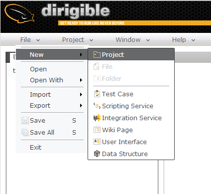

</li>

<li> In the wizard, enter the project name <b>bookstore</b> and click <i>Next</i>.  </li>
  
<li> From the list you can choose from several predefined project templates. In this case, just go to the first one - <b>Blank Dynamic Application</b>. 

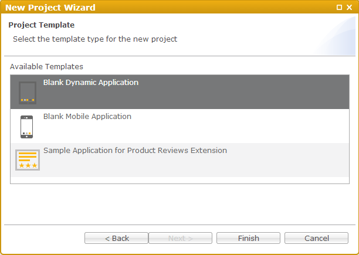
</li>

<li> Click <i>Finish<i> and open the project in the workspace to see the folder layout.

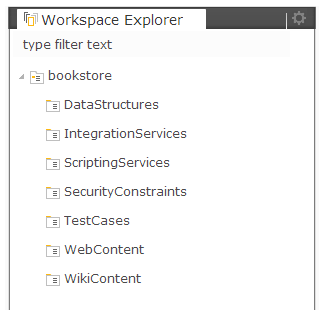 </li>

</ol>

There are several predefined folders, tightly related to the artifact types, which can be placed there as well as the corresponding activities you can make on them.

Data Model
---

Data models a.k.a [domain models](http://en.htmlpedia.org/wiki/Domain_model) is the set of entities of your application and also their relations.
In Dirigible, we use also the term [data structures](../help/data_structures.html), which is more related to the actual artifact - the data descriptor.
Let create the first model entity of the [BookStore](bookstore.html) sample - the books table.

Select the DataStructures sub-folder of a project and open the pop-up menu (right-click).
From the menu go to *New->Data Structure*

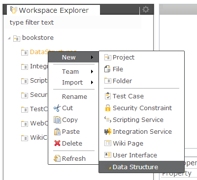

The first page of this wizard let you choose from the several artifacts related to the domain model. In this case we need a table where to store the books metadata like ISBN, Title, Author, etc.
Choose "Database Table" and click Next

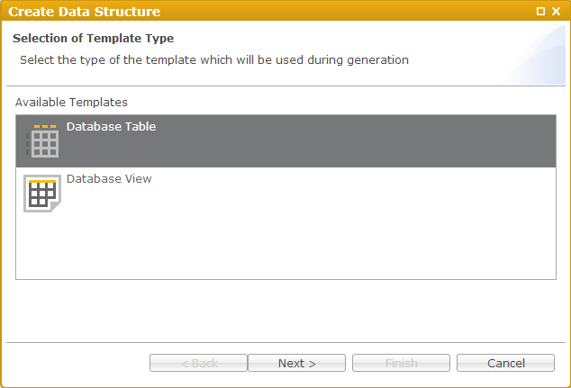

Use Add/Remove buttons to create the actual layout of the table

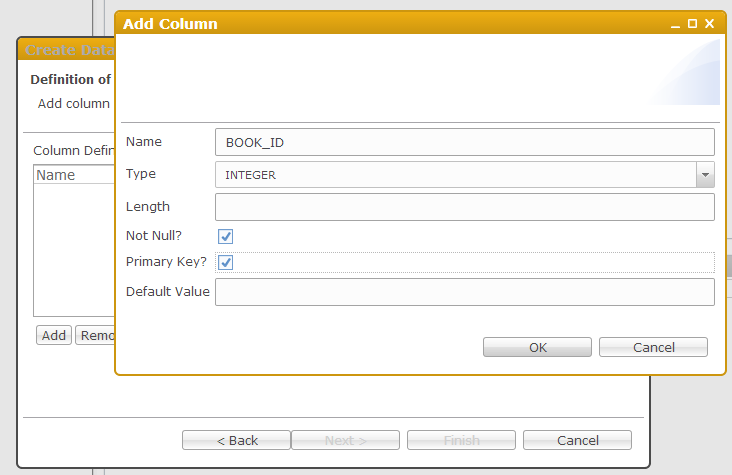

<pre><code>BOOK_ID                 INTEGER         not null    primaryKey
BOOK_ISBN               CHAR        13  not null
BOOK_TITLE              VARCHAR     200 not null
BOOK_AUTHOR             VARCHAR     100 not null
BOOK_EDITOR             VARCHAR     100
BOOK_PUBLISHER          VARCHAR     100
BOOK_FORMAT             VARCHAR     100
BOOK_PUBLICATION_DATE   DATE
BOOK_PRICE              DOUBLE          not null
</code></pre>

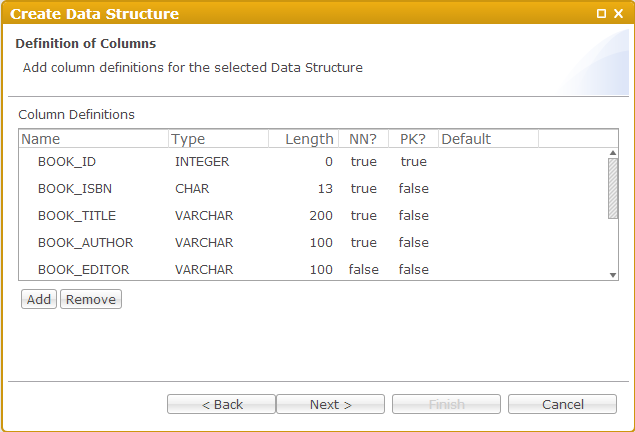

Give a name and click finish

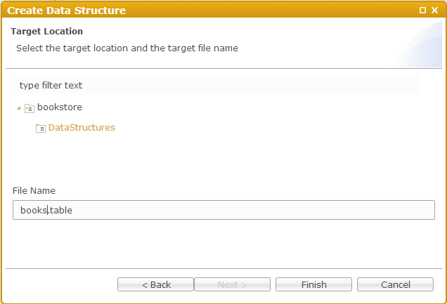

The table descriptor should be generated, based on your input and the file itself should be opened in the editors area

![New DataStructures Content]bookstore/11_books_new_ds_content.png!

<pre><code>{
  "tableName":"BOOKS",
  "columns":
    [
      {
        "name":"BOOK_ID",
        "type":"INTEGER",
        "length":"0",
        "notNull":"true",
        "primaryKey":"true",
        "defaultValue":""
      }
      ,
      {
        "name":"BOOK_ISBN",
        "type":"CHAR",
        "length":"13",
        "notNull":"true",
        "primaryKey":"false",
        "defaultValue":""
      }
      ,
      {
        "name":"BOOK_TITLE",
        "type":"VARCHAR",
        "length":"200",
        "notNull":"true",
        "primaryKey":"false",
        "defaultValue":""
      }
      ,
      {
        "name":"BOOK_AUTHOR",
        "type":"VARCHAR",
        "length":"100",
        "notNull":"true",
        "primaryKey":"false",
        "defaultValue":""
      }
      ,
      {
        "name":"BOOK_EDITOR",
        "type":"VARCHAR",
        "length":"100",
        "notNull":"false",
        "primaryKey":"false",
        "defaultValue":""
      }
      ,
      {
        "name":"BOOK_PUBLISHER",
        "type":"VARCHAR",
        "length":"100",
        "notNull":"false",
        "primaryKey":"false",
        "defaultValue":""
      }
      ,
      {
        "name":"BOOK_FORMAT",
        "type":"VARCHAR",
        "length":"100",
        "notNull":"false",
        "primaryKey":"false",
        "defaultValue":""
      }
      ,
      {
        "name":"BOOK_PUBLICATION_DATE",
        "type":"DATE",
        "length":"0",
        "notNull":"false",
        "primaryKey":"false",
        "defaultValue":""
      }
      ,
      {
        "name":"BOOK_PRICE",
        "type":"DOUBLE",
        "length":"0",
        "notNull":"true",
        "primaryKey":"false",
        "defaultValue":""
      }
    ]
}
</code></pre>

More about the data structure types and their descriptors can be found [here](../help/data_structures.html)
Now we have to create the real database artifact in the underlying database. This can be done via publish action from the project's popup menu.

In this case (data structures artifacts) you can do the same also with activation action. Follow the links for more information about the differences between [activation](../help/activation.html) and [publishing](../help/publishing.html).

Once we have published successfully the project, we can go to Database perspective to double-check the table definition.
From main menu go to Window->Show Perspective->Database

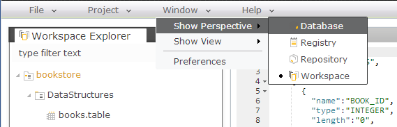

Open the database schema node and find the BOOKS table. Right-click and choose "Open Table Definition"

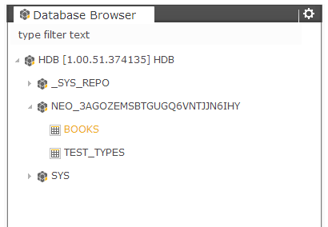

This will open the Table Definition Viewer

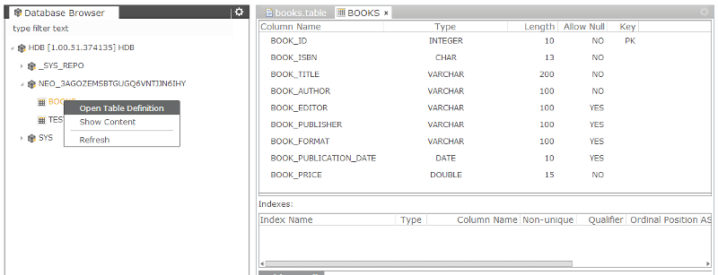

Entity Service
===

Entity Service meaning in terms of Dirigible is a RESTful service, which exposes the [CRUD](http://en.wikipedia.org/wiki/Create,_read,_update_and_delete] methods on top of the database table.
The following steps shows how to generate such an entity service on top of existing table.

Select the ScriptingServices sub-folder of the project and open the pop-up menu
From the menu go to *New->Scripting Service*

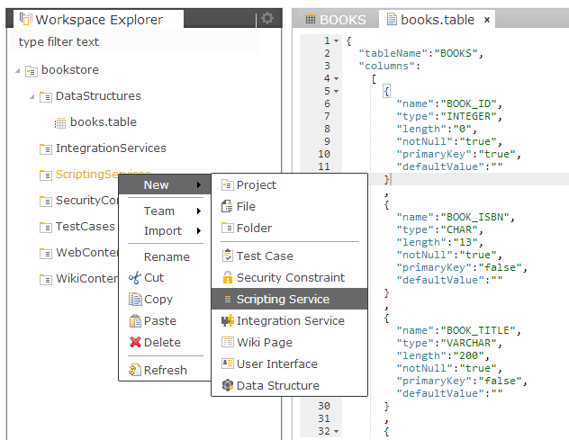

From the opened wizard select the "Entity Service" from the list of available templates.

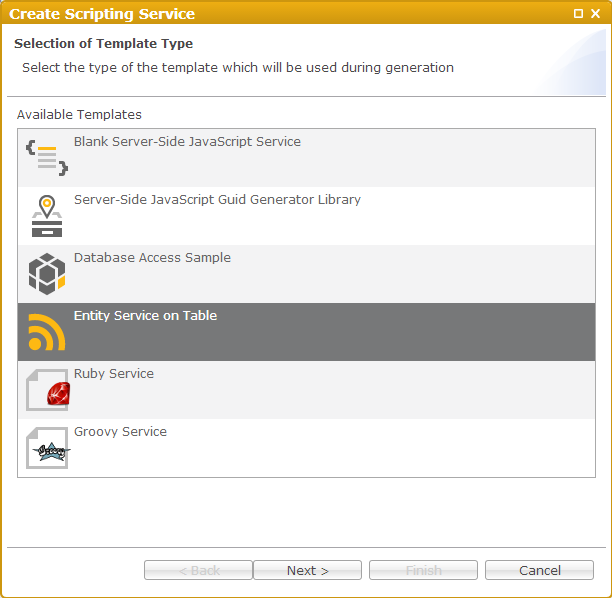

Once you have selected the "Entity Service" template and click "Next", the page which will be shown is specific one - lists all the available tables from the current database schema.

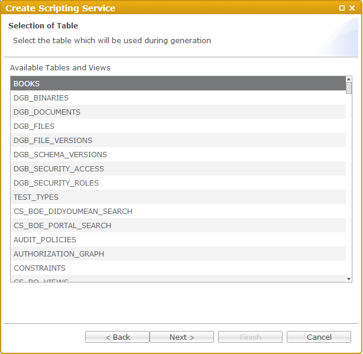

Give the name of your entity service on the next page and click finish

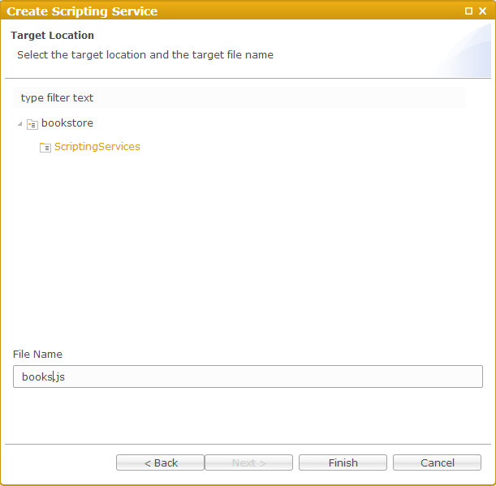

The generated service should be opened in the editors area.

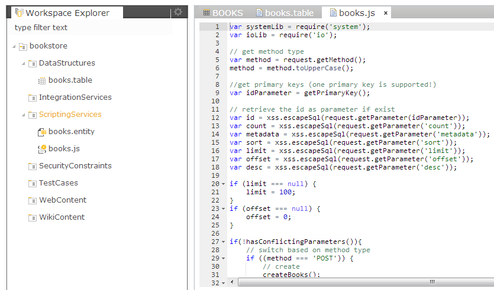

Now we can use activation action from the project's pop-up menu to enable the service

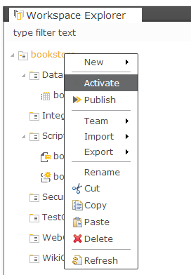

During the activation the artifact goes to the sandbox of the logged-in user. We can see the result of calling the service right away in the Preview (sould be opened by default in the Workspace Perspective), so find it (next to Properties view) and select it. Now go to the Workspace Explorer where the project is managed and select the service artifact (books.js). This will trigger the construction of the right URL of the service endpoint in the sandbox, hence you will see the result in the Preview.

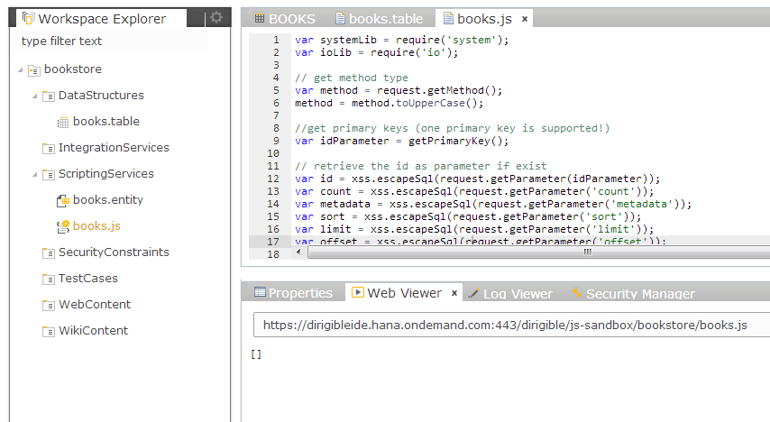

in this case just an empty JSON array.

If you like the result in the sandbox you can publish the service, so that it become accessible by the other users. 

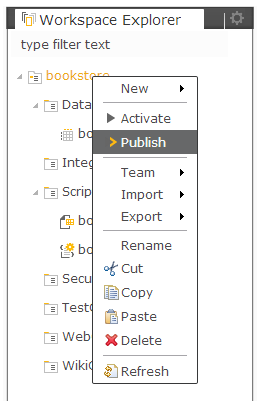

To find the URL you can go to the Registry Perspective. From the main menu go to Window->Show Pespective->Registry
The Registry Perspective is representing a view to the enabled runtime content. From its menu choose Scripting->JavaScript to open the currently available server-side JavaScript service endpoints.

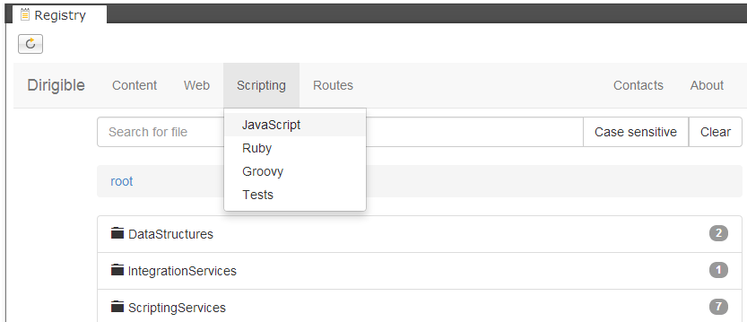

You can see the list of the available end-points, where you can find yours by naming convention <project>.<service path>

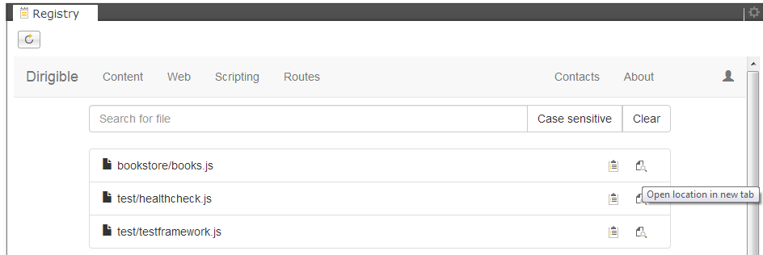

The link to the service can be copied to the clipboard via the first image at the right side of the row or can be directly opened by clicking on the second image.

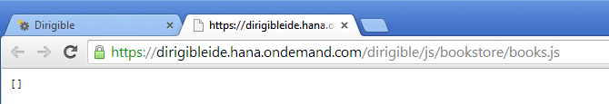

The naming convension for the service' endpoints URLs is as follows:

> *[protocol]://[host]:[port]/[dirigible's runtime application context]/[scripting container mapping]/[project]/[service path]*

e.g.

> *https ://dirigibleide.hana.ondemand.com/dirigible/js/bookstore/books.js*

The scripting containers mappings are:

*	JavaScript
	*	/js
	*	/js-secured
*	Ruby
	*	/rb
	*	/rb-secured
*	Groovy
	*	/groovy
	*	/groovy-secured
*	Test
	*	/test

The suffix "-secured" above shows the access point for the secured end-points. More info can be found [here](../help/security.html).

There are some specific requirement for the table to be able to be exposed as entity service (e.g. primary key have to be defined, it should be a single column, etc.).
Also the entity service itself support a bit more operations than the standard ones defined by HTTP. More about the entity services can be found [here](../help/entity_service.html).

Entity User Interface
===

After the creation of the data model and the entity service, now we will going to generate an user interface for entity management (list, new, edit, delete...)

Select the *books.entity* and open the pop-up menu. Choose *Generate->User Interface for Entity Service*

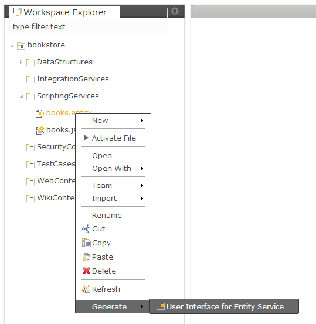

From the wizard select the template "List and Manage View"

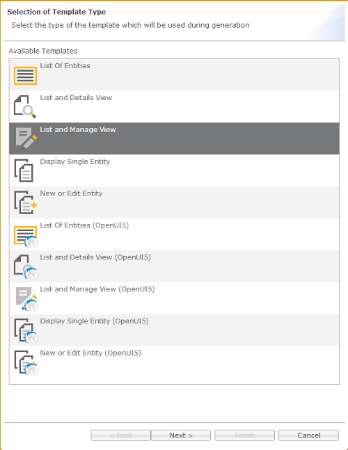

Click Next and select all the columns from the list. You can use "Select All" button

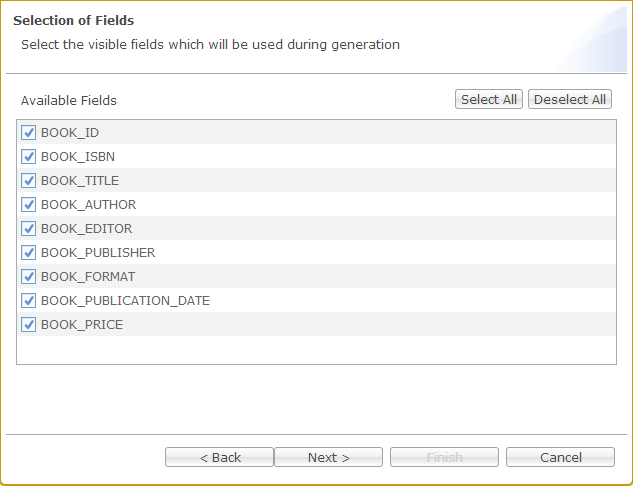

On the next page enter the name of the page *books_manage.html*

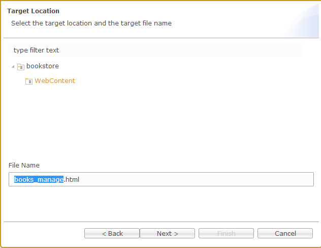

For the Title on the next page you can enter *Manage Books*

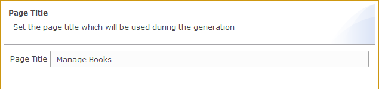

After clicking Finish button the generation is triggered. You can see the result under the WebContent folder
When you select the file with active Preview you shall see the resulted running page.

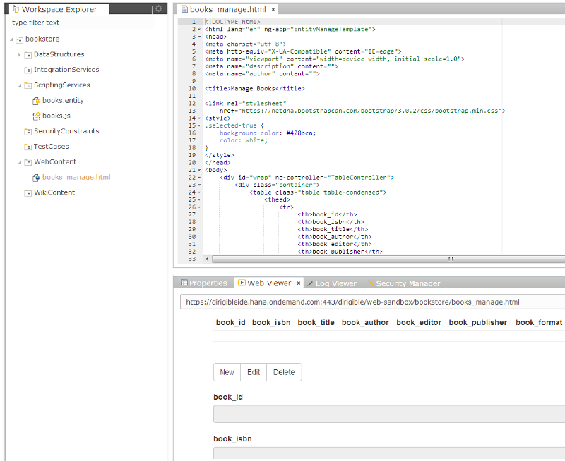

For the real test of the web page and the entity service you can [Publish](../help/publishing.html) the project

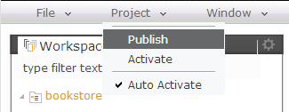

or

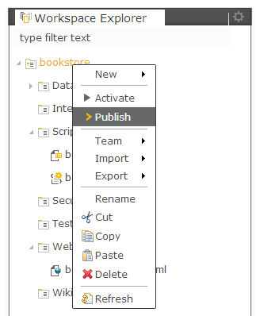

Now fo to the Registry perspective to find the link to the page, so that we can open it in an external browser.
From the Registry embedded page menu choose Web->Content

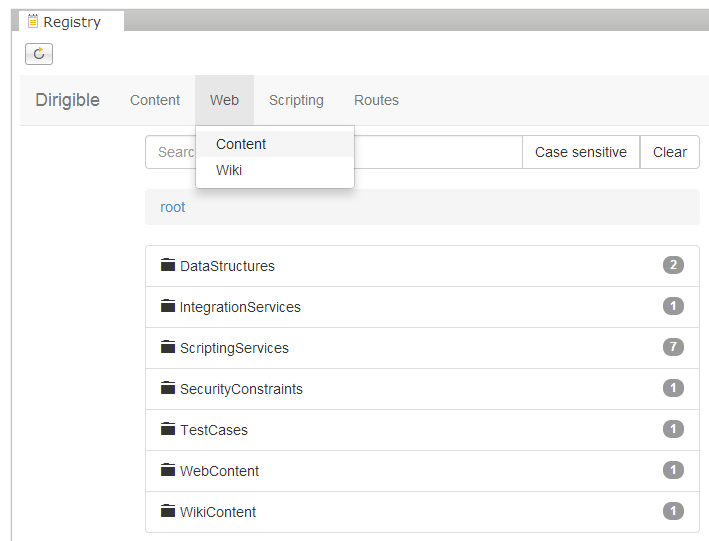

Drill-down in the bookstore project folder and click on the page which is listed.
To open the page in a new tab click on the icon on the right side

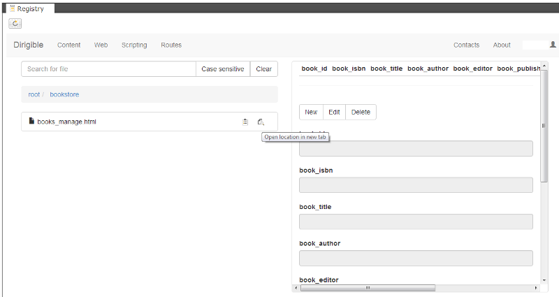

Click on "Edit" button and input the information about the first book you want to have in your store.

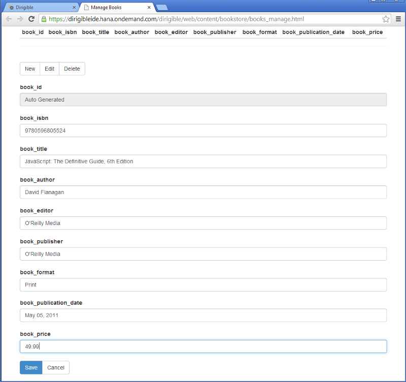

Click Save button and see the inserted record in the table above

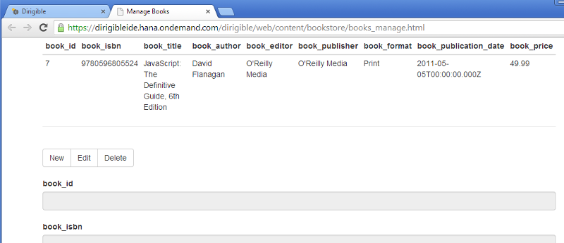

