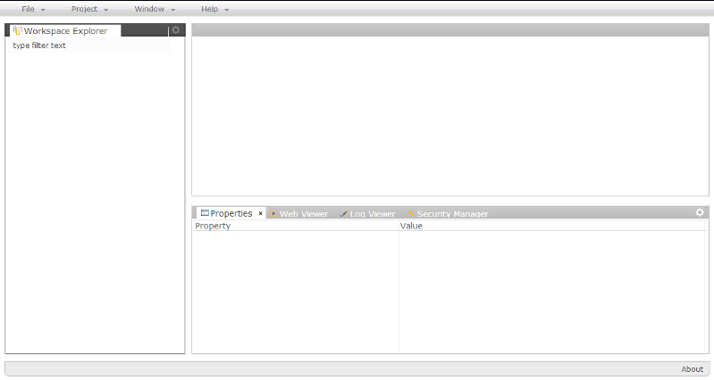
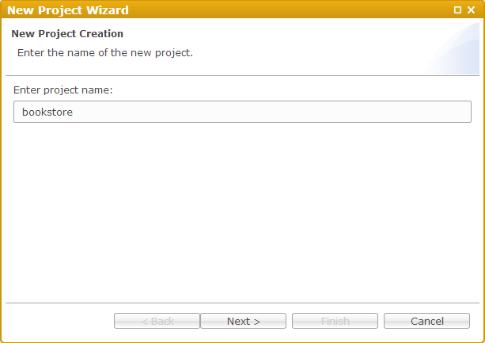

BookStore Sample
===

Overview
---

BookStore sample follows the steps required to build a simple online shop.
It will show you how to create the domain model in the target database, how to generate the RESTful services on top of the modeled entities and finally how to generate simple management user interface as a basis for the actual web design later.

Project Creation
---

First you need to create a project in your private workspace. Workspace perspective is the default one.

Go to the main menu *File->New->Project*

In the just opened wizard enter the project name - "bookstore" and click Next

From the list you can choose from several predefined project templates. 
In this case just go to the first one - "Blank Dynamic Application"

Click Finish and open the project in the workspace to see the folder layout

There are several predefined folders which are tightly related to the types of the artifacts which can be placed there as well as the corresponding activities you can make on them.

