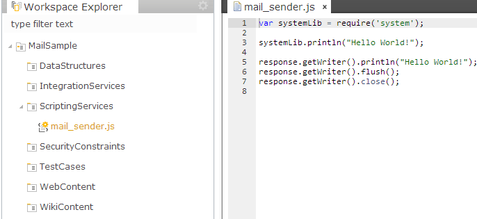
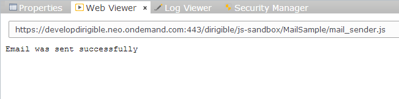

Mail Service
===

Develop
--
1. Create a new project or use an existing one.
2. Select the **ScriptingServices** sub-folder of the project and open the pop-up menu.
3. Choose **New** -> **Scripting Service**.
4. From the list of available templates choose **Server-Side JavaScript Service** .

	

5. Give it a meaningful name (e.g **mail_sender.js**) and click **Finish**.
6. After the generation, the project structure should look like this:

	

7. Now replace the generated code in **mail_sender.js** with the following one:

	```javascript
	
/* globals $ */
/* eslint-env node, dirigible */

var mail = require('service/mail');
var response = require('net/http/response');

var from = "sample@dirigble.io";
var to = "example@gmail.com";
var subject = "Mail Sample";
var content = "The mail sample from http://diriglble.io is working!";

mail.send(from, to, subject, content);

response.println("Email was sent successfully");
response.flush();
response.close();
	
	```

8. Now select the **Preview** view.
9. Click on **mail_sender.js** from the **Workspace Explorer**.
	> This will send a HTTP GET request to the service and it will send the e-mail.


	

Discover
--
To discover all available services, you can go to the [Registry](../help/registry.html).

1. From the main menu, choose **Window** -> **Show Perspective** -> **Registry**.
2. The **Registry** perspective represents a view to the enabled runtime content. From its menu, choose **Discover** -> **JavaScript** to open the currently available server-side JavaScript service endpoints.
3. You can see the list of available endpoints, where you can find yours by naming convention: **{project}/{service path}**
