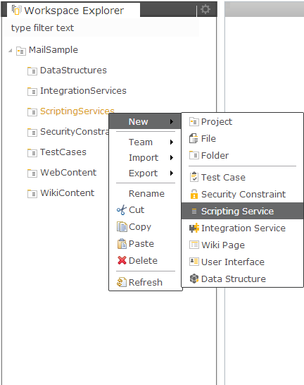
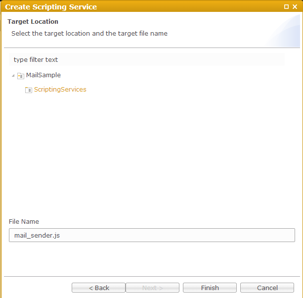

Mail Service
===

Create new project or use existing once.

Create new *Scripting Service*

Choose *Blank Server-Side JavaScript Service* from the list of available templates

Give it some meaningful name (e.g *mail_sender.js*)

Now the project structure should look like this

Replace the generated code in *mail_sender.js* with the following:

<pre><code>var from = 'employee@your.company.com';
var to = 'boss@your.company.com';
var title = 'Test Email Service';
var body = 'Hello Boss! The mail service is up and running!';
mail.sendMail(from, to, title, body);
response.getWriter().println('Email was sent successfully');
</code></pre>

Select *Preview* tab.
Click on *mail_sender.js* from the *Workspace Explorer*.
Accessing the scripting service will send the email.

