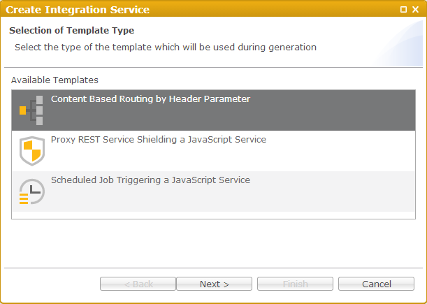
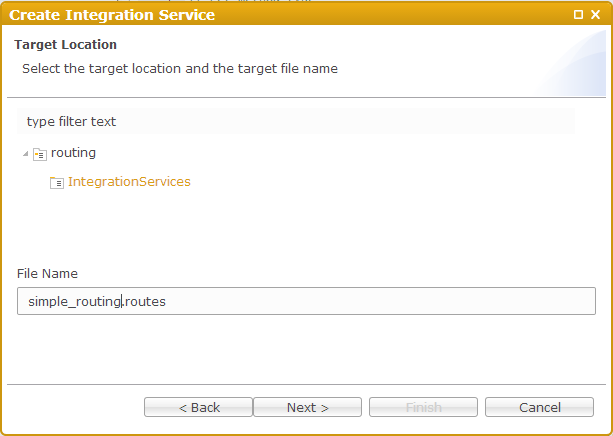
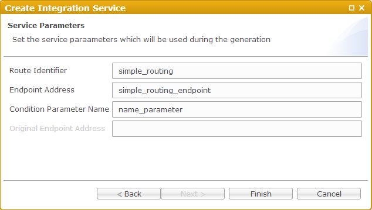

Routing
===

The simplest *Integration Service* you can have is the one that uses embedded DSL of [Apache Camel](http://camel.apache.org).
The general steps are valid for all other template types for the different integration patterns.

1. Create a simple project named **routing**.
2. From the project's pop-up menu, select *New* -> *Integration Service*.
  

  
3. From the template list in the wizard, chose **Content Based Routing by Header Parameter**.
  

  
4. Click *Next*.
5. Enter a name of the routes artifact (e.g. **simple_routing.routes**).
  

  
6. On the next page, enter the required parameters for this particular template:

> Route Identifier: *simple_routing*
> Endpoint Address: *simple_routing_endpoint*
> Condition Parameter Name: *name_parameter*

  
7. Click *Finish* and inspect the generated artifact, which should look like this:
  
<pre><code>< routes xmlns="http://camel.apache.org/schema/spring">
    < route id="simple_routing">
        < from uri="servlet:///simple_routing_endpoint" />
        < choice>
            < when>
                < header>name_parameter</header>
                < transform>
                    < simple>Hello ${header.name_parameter} how are you?</simple>
                < /transform>
            < /when>
            < otherwise>
                < transform>
                    < constant>Add a name parameter to uri, eg ?name_parameter=foo</constant>
                < /transform>
            < /otherwise>
        < /choice>
    < /route>
< /routes>
</code></pre>
8. Now *Activate* ot *Publish* the project and it's done. (See [Activate](../help/activation.html) or [Publish](../help/publishing.html))
  
9. Go to following location and try it:

> *http //[host]:[port]/dirigible/camel/simple_routing_endpoint*

The pattern which is used for generating the location URL can be found [here](../help/integration_services.html)

