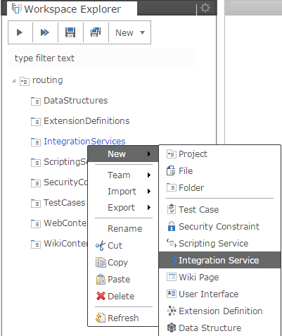
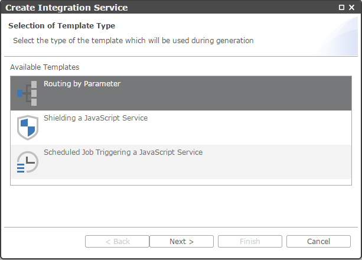
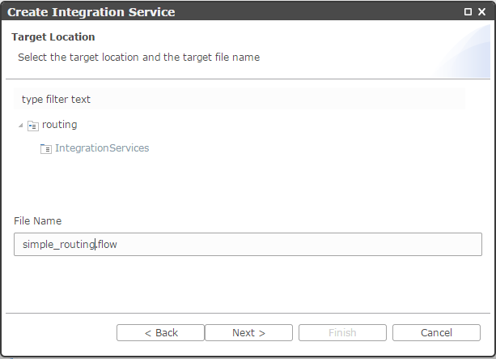
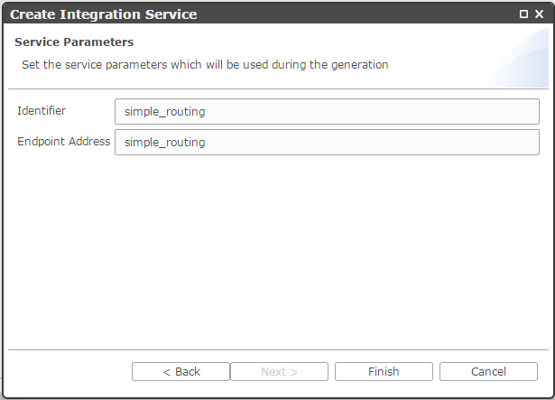

Routing by Parameter
===

The simplest *Integration Service* you can have is the routing by parameter.
The general steps are valid for all other template types for the different integration patterns.

1. Create a simple project named **routing**.
2. From the project's pop-up menu, select *New* -> *Integration Service*.

<br>



<br>

3. From the template list in the wizard, chose **Routing by Parameter**.

<br>



<br>

4. Click *Next*.
5. Enter a name of the routes artifact (e.g. **simple_routing.flow**).

<br>



<br>

6. On the next page, enter the required parameters for this particular template:

> Identifier: *simple_routing*

> Endpoint Address: *simple_routing_endpoint*



<br>

7. Click *Finish* and inspect the generated artifact, which should look like this:

<br>

```javascript

	{  
	   "name":"simple_routing",
	   "properties":{
	      "myKey2":"myValue2",
	      "myKey1":"myValue1"
	   },
	   "steps":[  
	      {  
	         "type":"condition",
	         "name":"1",
	         "cases":[  
	            {  
	               "key":"name",
	               "value":"Joe",
	               "flow":{
	                  "name":"WelcomeJoe",
	                  "steps":[  
	                     {  
	                     	"name":"4",
	                        "type":"output",
	                        "message":"Welcome Joe"
	                     }
	                  ]
	               }
	            },
	            {  
	               "key":"name",
	               "value":"null",
	               "flow":{  
				      "name":"NoName",
	                  "steps":[  
	                     {  
	                     	"name":"5",
	                        "type":"output",
	                        "message":"Add to the request URL '?name=Joe'"
	                     }
	                  ]
	               }
	            }
	         ]
	      }
	   ]
	}

```

8. Now *Activate* ot *Publish* the project and it's done. (See [Activate](../help/activation.html) or [Publish](../help/publishing.html))
<br>
9. Go to following location and try it:

> *http //[host]:[port]/dirigible/services/flow/project/simple_routing.flow*

The pattern which is used for generating the location URL can be found [here](../help/integration_services.html).

