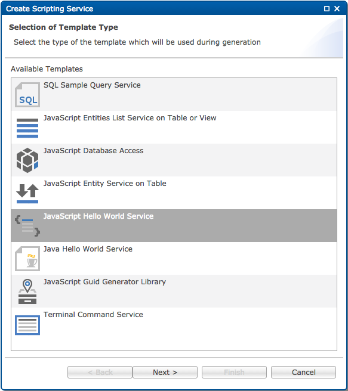

Storage
===

1. Create a new project or use an existing one.
2. Create a new *Scripting Service*
3. Choose **Blank Server-Side JavaScript Service** from the list of available templates.

<br>



<br>

4. Give the service a meaningful name (e.g **storage_usage.js**).
5. Replace the generated code in *storage_usage.js* with the following:

```javascript

	function toString(bytes) {
	    var s = "";
	    for(var i=0, l=bytes.length; i < l; i++) {
	        s += String.fromCharCode(bytes[i]);
	    }
	    return s;
	}
	var byteArray = [49,50,51]; // string "123"
	$.getBinaryStorage().put("/a/b/c", byteArray);
	var retrievedData = $.getBinaryStorage().get("/a/b/c");
	var result = toString(retrievedData);
	$.getResponse().getWriter().println(result);
	$.getResponse().setContentType("text/html");
	$.getResponse().getWriter().flush();
	$.getResponse().getWriter().close();

```

6. Select the *Preview* tab.

<br>

7. Click on **storage_usage.js** from the *Workspace Explorer* and check the result.

> put(path, data) - add binary data at given path

> get(path) - retrieves binary data by given path

> delete(path) - removes binary data by given path

> clear() - removes all the data from the storage
